# CLAUDE.md

caret is a tool-agnostic core plus one adapter axis — the coding agent it speaks to. It
routes that agent's plan to a human for review; a loopback daemon serves a Svelte UI.
Detailed contributor rules live in [`doc/agents/`](doc/agents/) and load **on demand**.
This file is the router that decides which ones a given change needs.

## Routing

Read the digraph as a checklist, not a single path: start from the change you're about to
make, and **load every reference whose edge matches** — a change that spans areas pulls in
several. Read the matching `doc/agents/*.md` file into context *before* you edit that
area, not after.

```graphviz
digraph caret_rules_router {
    "Working on caret" [shape=doublecircle];
    "What does the change touch?" [shape=diamond];

    "Load doc/agents/architecture-rules.md" [shape=box];
    "Load doc/agents/typescript-rules.md" [shape=box];
    "Load doc/agents/svelte-rules.md" [shape=box];
    "Load doc/agents/shadcn-rules.md" [shape=box];
    "Load doc/agents/browser-testing.md" [shape=box];
    "Load doc/agents/test-layout.md" [shape=box];
    "Load doc/agents/logging-rules.md" [shape=box];
    "Load doc/agents/settings-rules.md" [shape=box];
    "Load doc/agents/icon-rules.md" [shape=box];
    "Load doc/agents/opencode-integration.md" [shape=box];
    "Load doc/agents/documentation-rules.md" [shape=box];

    "Working on caret" -> "What does the change touch?";
    "What does the change touch?" -> "Load doc/agents/architecture-rules.md" [label="core/adapter boundary, daemon routing, @core shared modules"];
    "What does the change touch?" -> "Load doc/agents/typescript-rules.md" [label="TS module shape: DI, file-split seams, zod boundaries, helpers, import aliases (@/)"];
    "What does the change touch?" -> "Load doc/agents/svelte-rules.md" [label="Svelte UI in ui/: components, runes, state factories, CSS tokens"];
    "What does the change touch?" -> "Load doc/agents/shadcn-rules.md" [label="composing UI from shadcn-svelte components: compose-first norm, token bridge, icon swap, what stays custom"];
    "What does the change touch?" -> "Load doc/agents/browser-testing.md" [label="testing browser behavior: e2e vs. unit, the e2e harness"];
    "What does the change touch?" -> "Load doc/agents/test-layout.md" [label="where a backend test suite belongs under test/"];
    "What does the change touch?" -> "Load doc/agents/logging-rules.md" [label="logging: levels, message style, redaction"];
    "What does the change touch?" -> "Load doc/agents/settings-rules.md" [label="adding a config.toml key or CARET_* env var"];
    "What does the change touch?" -> "Load doc/agents/icon-rules.md" [label="adding or working with vendored icons"];
    "What does the change touch?" -> "Load doc/agents/opencode-integration.md" [label="OpenCode adapter, plugin, or install (caret install --target opencode)"];
    "What does the change touch?" -> "Load doc/agents/documentation-rules.md" [label="documentation: which doc to update — README, the doc/ reference pages (CONFIGURING, RUNNING, ARCHITECTURE, DEVELOPMENT), CONTRIBUTING, the doc/ router, or the doc map itself"];
}
```

## CodeGraph

**First check.** If `.codegraph/` doesn't exist in this repo, ask once:
*"This project doesn't have CodeGraph initialized — want me to run `codegraph init -i`?"*
If they decline or skip, ignore the rest of this section.

**The habit to override.** When `.codegraph/` exists, `codegraph_*` is the default for any
question about symbols, call graphs, or "how does X work" — not grep + Read. Codegraph IS
the pre-built index: a full AST parse already sitting in SQLite, sub-millisecond reads. If
you're about to grep for a function name or Read a file to find a definition, stop —
`codegraph_search` / `codegraph_context` is one call and returns more (kind, location,
signature, docstring).

Grep and Read are for **literal text** — log messages, comments, string contents — or
files you already have open.

The detailed tool-selection table and common chains live in the codegraph MCP server's own
instructions, which are already loaded into every session. This section adds the
project-level emphasis those instructions can't carry: *when* to reach for codegraph in
the first place.

### Worked example

User: *"How does auth work in this repo?"*

- **Wrong reflex**: `grep -ri "auth" .`, Read four files, maybe spawn an Explore subagent
  to make sense of it.
- **Right reflex**: `codegraph_context("authentication")` → if more breadth is needed, one
  `codegraph_explore` over the symbols it surfaced. Two calls, done. Spawning a subagent
  here repeats work the index already did.

### Red flags — you're about to skip codegraph

| Thought | Reality |
|---|---|
| "I'll just grep quickly to find it" | `codegraph_search` is faster and returns kind + location + signature in one call. |
| "Let me Read the file first to orient" | If you're looking up a symbol, `codegraph_node` returns just that symbol's source. |
| "I'll spawn an Explore subagent" | Codegraph IS the pre-built index — the agent would re-derive what's already indexed. |
| "Let me verify the codegraph result with grep" | Don't. AST parse beats text search; re-verifying wastes context. |
| "I'll chain `codegraph_search` then `codegraph_node`" | Use `codegraph_context` — one call instead of two. |

### Index lag

The file watcher debounces ~500ms behind writes. Don't re-query codegraph immediately
after editing a file in the same turn — give it a beat, or trust your edit.

## Verifying changes

`mise run preflight` is the pre-push gate — lint, unit + e2e tests, build, and artifact
smoke, run concurrently. When **you** (an agent) run it, pass `--json`.
`mise run preflight --json` replaces the live human display with two compact JSON
documents on stdout, one per line: a `start` document (the planned tasks, why that set,
plus the filters in effect) and a `result` document carrying each task's status and an
overall `ok` boolean. The exit code is unchanged (`0` pass, `1` fail).

**The gate scopes itself to your diff, so `ok` does not always mean all six tasks ran.** A
change where every path is Markdown runs `lint` alone — plus `test` when it touches one of
the Markdown files a test reads from disk (`MARKDOWN_READ_BY_TESTS` in
`scripts/preflight.ts`: `scripts/tasks/dev/fake-plan.md`, `doc/ARCHITECTURE.md`,
`THIRD_PARTY_LICENSES.md`, and `doc/DEVELOPMENT.md`). Anything else runs the full six, as
does an empty or unreadable diff. Read the `start` document's `selection` object before
you report a run as green: `{"narrowed": true, "reason": "…"}` means you proved less than
the whole gate, and `schemaVersion` is `2` precisely because `ok` now means "every task
that ran passed". `--full` forces all six — it is the one preflight flag that works
without `--json` too. Note that `lint` always scans the whole tree even when the gate
narrows, so cross-file link fragments stay checked.

`mise run preflight --json` is the call you want almost every time.
**Failures show their output by default**, so you can act immediately — and if a task's
output is large it's abbreviated to its last 20 lines with `totalLines` and
`"truncated": true` so you know there's more. Passing tasks stay status-only to keep the
result small. The flags below turn that up; they compose and only apply with `--json`:

- `-v` / `-vv` — turn up verbosity. `-v` makes any **truncated** failure full and adds a
  snippet of each passing task; `-vv` shows every task's full output. Reach for `-v` when
  a failure's tail was truncated and you need the whole log, or when you want to inspect a
  passing task.
- `--grep <regex>` — replace `output` with only the lines matching the pattern (plus
  `matchedLines`), scanning every in-scope task. Reach for it to pull specific lines (an
  error code, a file path) out of a large log without `-v`.
- `--task <name>` (repeatable) — scope output to the named task(s); they show full output
  (or, with `--grep`, the matching lines) and other tasks report status only. Reach for it
  when you know which task you're debugging.

An invalid `--grep` pattern emits an `{"event":"error"}` document and exits `2` without
running. Plain `mise run preflight`, the human-readable form, is the one documented in the
README.
