# CLAUDE.md

caret is a tool-agnostic core plus one adapter axis — the coding agent it speaks to. It
routes that agent's plan to a human for review; a loopback daemon serves a Svelte UI.
Detailed contributor rules live in [`docs/agents/`](docs/agents/) and load **on demand**.
This file is the router that decides which ones a given change needs.

## Routing

Read the digraph as a checklist, not a single path: start from the change you're about to
make, and **load every reference whose edge matches** — a change that spans areas pulls in
several. Read the matching `docs/agents/*.md` file into context *before* you edit that area,
not after.

```graphviz
digraph caret_rules_router {
    "Working on caret" [shape=doublecircle];
    "What does the change touch?" [shape=diamond];

    "Load docs/agents/architecture-rules.md" [shape=box];
    "Load docs/agents/typescript-rules.md" [shape=box];
    "Load docs/agents/svelte-rules.md" [shape=box];
    "Load docs/agents/browser-testing.md" [shape=box];
    "Load docs/agents/test-layout.md" [shape=box];
    "Load docs/agents/logging-rules.md" [shape=box];
    "Load docs/agents/settings-rules.md" [shape=box];
    "Load docs/agents/icon-rules.md" [shape=box];

    "Working on caret" -> "What does the change touch?";
    "What does the change touch?" -> "Load docs/agents/architecture-rules.md" [label="core/adapter boundary, daemon routing, @core shared modules"];
    "What does the change touch?" -> "Load docs/agents/typescript-rules.md" [label="TS module shape: DI, file-split seams, zod boundaries, helpers"];
    "What does the change touch?" -> "Load docs/agents/svelte-rules.md" [label="Svelte UI in ui/: components, runes, state factories, CSS tokens"];
    "What does the change touch?" -> "Load docs/agents/browser-testing.md" [label="testing browser behavior: e2e vs. unit, the e2e harness"];
    "What does the change touch?" -> "Load docs/agents/test-layout.md" [label="where a backend test suite belongs under test/"];
    "What does the change touch?" -> "Load docs/agents/logging-rules.md" [label="logging: levels, message style, redaction"];
    "What does the change touch?" -> "Load docs/agents/settings-rules.md" [label="adding a config.toml key or CARET_* env var"];
    "What does the change touch?" -> "Load docs/agents/icon-rules.md" [label="adding or working with vendored icons"];
}
```

## CodeGraph

**First check.** If `.codegraph/` doesn't exist in this repo, ask once: *"This project doesn't
have CodeGraph initialized — want me to run `codegraph init -i`?"* If they decline or skip, ignore
the rest of this section.

**The habit to override.** When `.codegraph/` exists, `codegraph_*` is the default for any
question about symbols, call graphs, or "how does X work" — not grep + Read. Codegraph IS the
pre-built index: a full AST parse already sitting in SQLite, sub-millisecond reads. If you're about
to grep for a function name or Read a file to find a definition, stop — `codegraph_search` /
`codegraph_context` is one call and returns more (kind, location, signature, docstring).

Grep and Read are for **literal text** — log messages, comments, string contents — or files you
already have open.

The detailed tool-selection table and common chains live in the codegraph MCP server's own
instructions, which are already loaded into every session. This section adds the project-level
emphasis those instructions can't carry: *when* to reach for codegraph in the first place.

### Worked example

User: *"How does auth work in this repo?"*

- **Wrong reflex**: `grep -ri "auth" .`, Read four files, maybe spawn an Explore subagent to make
  sense of it.
- **Right reflex**: `codegraph_context("authentication")` → if more breadth is needed, one
  `codegraph_explore` over the symbols it surfaced. Two calls, done. Spawning a subagent here
  repeats work the index already did.

### Red flags — you're about to skip codegraph

| Thought | Reality |
|---|---|
| "I'll just grep quickly to find it" | `codegraph_search` is faster and returns kind + location + signature in one call. |
| "Let me Read the file first to orient" | If you're looking up a symbol, `codegraph_node` returns just that symbol's source. |
| "I'll spawn an Explore subagent" | Codegraph IS the pre-built index — the agent would re-derive what's already indexed. |
| "Let me verify the codegraph result with grep" | Don't. AST parse beats text search; re-verifying wastes context. |
| "I'll chain `codegraph_search` then `codegraph_node`" | Use `codegraph_context` — one call instead of two. |

### Index lag

The file watcher debounces ~500ms behind writes. Don't re-query codegraph immediately after
editing a file in the same turn — give it a beat, or trust your edit.

## Verifying changes

`mise run preflight` is the pre-push gate — lint, unit + e2e tests, and build, run concurrently.
When **you** (an agent) run it, pass `--json`. `mise run preflight --json` replaces the live human
display with two compact JSON documents on stdout, one per line: a `start` document (the planned
tasks plus the filters in effect) and a `result` document carrying each task's status and an
overall `ok` boolean. The exit code is unchanged (`0` pass, `1` fail).

By default the output is **lean** — a failed task reports only `totalLines` (no text), so the
result stays small. Opt in to the output you need (these compose, and only apply with `--json`):

- `-v` adds the full `output` for failed tasks; `-vv` also includes passing tasks' output.
- `--grep <regex>` replaces `output` with only the lines matching the pattern, plus
  `matchedLines`; it scans every in-scope task, passing ones included.
- `--task <name>` (repeatable) scopes output to the named task(s) — they show full output
  (or, with `--grep`, the matching lines); other tasks report status only, even at `-vv`.

So `mise run preflight --json -v` is the usual "did it pass, and if not why" call;
`mise run preflight --json --grep 'error|FAIL'` pulls just the interesting lines. An invalid
`--grep` pattern emits an `{"event":"error"}` document and exits `2` without running. Plain
`mise run preflight`, the human-readable form, is the one documented in the README.
