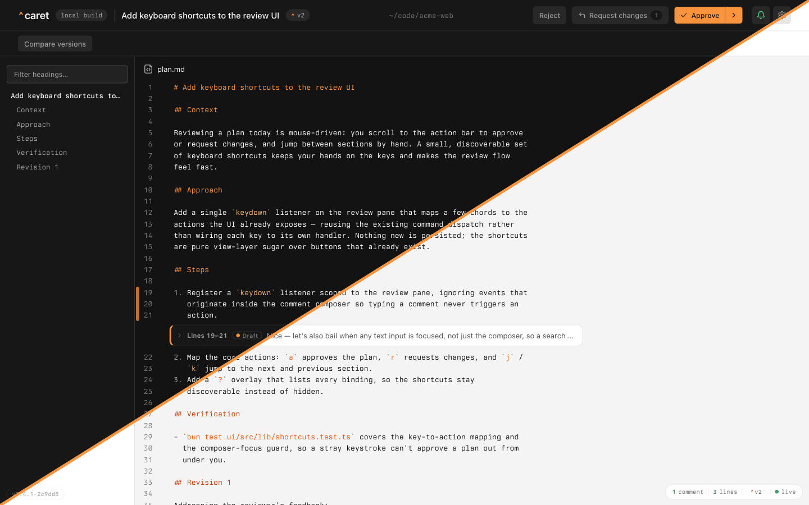

# 🥕 caret

> ⚠️ **Prototype.** caret is an early prototype and may change substantially over the next
> little while — interfaces, hooks, storage, and the install flow are all still settling.
> Expect rough edges and breaking changes.

caret is a Claude Code (and OpenCode) plugin that replaces the terminal plan-approval
prompt with a local web UI. When your agent presents a plan, caret opens it in your
browser so you can read it as rendered HTML, **annotate passages inline** (Google-Docs
style), and **approve** or **request changes** — your feedback flows straight back to the
agent. A single local daemon is shared across concurrent sessions, so several in-flight
plans can be reviewed from one browser tab via a switcher.

Want to develop caret rather than use it? Start with [CONTRIBUTING.md](CONTRIBUTING.md).

## Screenshots



## Install

caret needs [`bun`](https://bun.sh) on your `PATH` — it runs from a `bun` bundle.

```sh
bunx --no-cache @macintacos/caret@latest install
```

That one command is the whole install. It detects which agents you have —
[Claude Code](https://claude.com/claude-code), [OpenCode](https://opencode.ai), or both —
asks which of them to install into, and registers the _published_ caret with each:
prebuilt artifacts, the `/caret:*` slash commands, and the [rumdl](https://rumdl.dev/)
plan formatter, with no `git clone` and no compile step. Where it can't ask — off a
terminal — it installs into every agent it detected. `--target claude` or
`--target claude,opencode` pins the agents non-interactively, and `--dry-run` previews the
run without changing anything.

Restart the agent afterward — OpenCode installs the plugin package on its next start —
then try `/caret:demo`, which presents a short fake plan to exercise the flow.

### Updating and uninstalling

**Update.** One command for every agent:

```sh
bunx --no-cache @macintacos/caret@latest install --refresh
```

`--target` pins the agents the same way it does on install, and restarting each one
applies the update. In OpenCode, caret toasts you at startup when a newer release is out;
a plain `install` at a terminal runs its own check against npm and asks before taking it.
See [`doc/ADVANCED.md`](doc/ADVANCED.md#how-it-works) for the by-hand equivalents and for
pinning a version in OpenCode's config.

**Uninstall.** The same command, one flag:

```sh
bunx --no-cache @macintacos/caret@latest install --uninstall
```

It offers the same chooser in reverse, and `--target` pins it the same way. See
[`doc/ADVANCED.md`](doc/ADVANCED.md#how-it-works) for what each agent's install touches
and how the integrations work.

## Using caret

Whenever your agent presents a plan — Claude Code's `ExitPlanMode`, or the Plan agent in
OpenCode — caret intercepts it and opens it in your browser instead of the terminal
prompt. There you:

- **Read** the plan as rendered HTML.
- **Annotate** — select any passage to attach an inline comment.
- **Decide** — **Approve** (optionally also switching the session into accept-edits or
  auto mode) or **Request changes**, which sends your comments back to the agent to revise
  and re-present.

A single local daemon serves every session, so concurrent plans queue up in one tab behind
a switcher.

**In OpenCode**, you don't have to wait to be intercepted: caret registers a
`caret_review_plan` tool your agent can call directly, so a skill of your own can route
its approval step through the same review UI. Claude Code has no equivalent — see
[`doc/ADVANCED.md`](doc/ADVANCED.md#calling-the-review-tool-from-your-own-skill).

## Configuration

caret runs with sensible defaults and needs no configuration. To tune it, it reads an
optional `config.toml` and `CARET_*` environment variables (for example the daemon port or
the review timeout); logs are written raw by default. The full list of keys, their
defaults, and the environment variables is in
[`doc/ADVANCED.md`](doc/ADVANCED.md#configuration).

## Reporting bugs

- `/caret:discovery` prints a one-shot, read-only diagnostics snapshot of your install —
  ready to paste into a bug report.
- `/caret:debug` reviews the current session's plans and recent errors.

Details, plus how to scrub logs with `caret redact`, are in
[`doc/ADVANCED.md`](doc/ADVANCED.md#logging--debugging).

## Platform support

caret is **macOS-first**; Linux and Windows are best-effort. See
[`doc/ADVANCED.md`](doc/ADVANCED.md#platform-support) for the details.

## Documentation

- [`doc/ADVANCED.md`](doc/ADVANCED.md) — the deep reference: build-from-source,
  architecture, the agent adapters, the full configuration surface, and the development
  workflow.
- [CONTRIBUTING.md](CONTRIBUTING.md) — develop caret locally: setup, the `mise` workflow,
  and where tests live.
- [`doc/`](doc/) — contributor rules-of-the-road, routed from [CLAUDE.md](CLAUDE.md).

## License

MIT — see [LICENSE](LICENSE). Vendored third-party assets (the Lucide icons) are itemized
in [THIRD_PARTY_LICENSES.md](THIRD_PARTY_LICENSES.md) (ISC).
