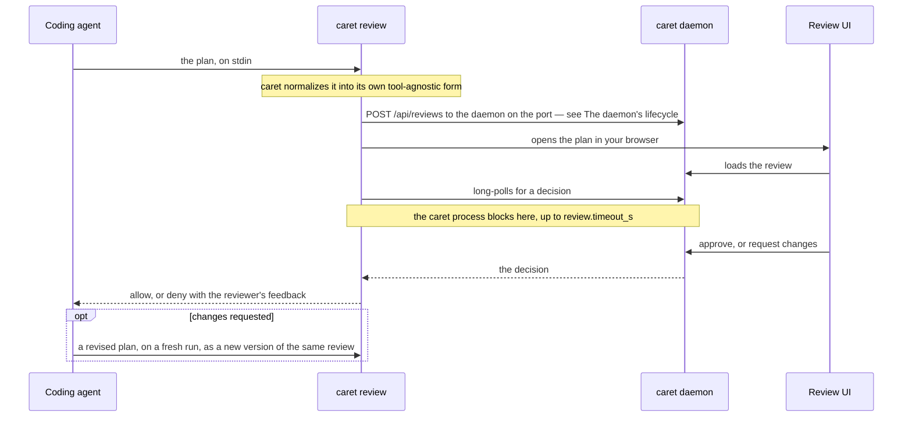

# caret — Architecture

*Audience: users and contributors who want caret's internals — the core/adapter boundary,
the agent adapters, the review tool, and the source layout.*

Part of the deep reference behind [README.md](../README.md). For what caret is, how to
install it, and basic usage, start there.

## How it works

Every plan makes the same round trip: your coding agent hands it to caret, caret serves it
to you in your browser from a loopback HTTP daemon on your own machine, and your decision
goes back to the agent as its answer.



> [!IMPORTANT]
> **Fail-safe = deny.** On a bad payload, an unreachable daemon, a timeout, a signal, or
> daemon death, caret emits `deny` with an explanation — it never auto-approves an
> unreviewed plan.

Your agent reaches caret through `bin/caret`, a small entrypoint shim that runs caret's
subcommands: Claude Code fires it as a hook, OpenCode's plugin spawns it from a tool. The
shim execs the platform-native compiled binary (`bin/caret-native`) when a
`mise run build` produced one, and otherwise runs the `bun` bundle (`dist/cli.js`) that
the marketplace and npm installs ship.

### The daemon's lifecycle

What starts a daemon decides how long it stays up. There are three ways:

- **The caret service.** `caret install`, answered **Keep it running**, registers a
  launchd agent on macOS or a systemd user unit on Linux. The supervisor starts the daemon
  at login and restarts it when it exits. That daemon is **resident**: it stays up until
  told to stop.
- **`caret serve`.** Also resident, but in your terminal's foreground with no supervisor
  behind it.
- **On demand.** When nothing holds the port and no service will, the hook spawns a daemon
  itself. That **on-demand daemon** exits after `daemon.idle_ms` with no pending review,
  no open long-poll, and no live UI tab.

The service never names a caret build. Its unit runs the launcher, `bin/caret-launcher`,
copied to `$XDG_STATE_HOME/caret/bin/caret`, which picks caret each time it starts: the
checkout a `--from-local` install pinned, else the highest-versioned caret across the
Claude Code plugin cache and the OpenCode package cache. Nothing in the unit depends on
the version, so restarting the service is the upgrade.

Every review and prewarm hook first makes sure a current daemon holds the port
(`ensureDaemon`, `src/daemon/lifecycle.ts`):

- A daemon of the hook's own build is reused.
- A daemon of another build that `/api/health` reports as `supervised` belongs to the
  service. When the install that registered that service shares the hook's state
  directory, the hook restarts the service and waits for a daemon with a new `instanceId`,
  since retiring it would only race the supervisor. It leaves the daemon alone when that
  daemon is newer than the hook or the launcher is pinned.
- Any other stale daemon gets `POST /api/retire`, and the hook spawns its own. That covers
  an on-demand daemon, `caret serve`, and a supervised daemon whose service another state
  directory registered.
- When nothing holds the port but the service will start a daemon, the hook leaves it to
  the supervisor for `SUPERVISOR_WINDOW_MS` before spawning one.
- A review hook whose long-poll drops mid-review only reattaches, to whatever daemon of
  its state directory answers, whatever its build.

`caret serve` retires an unsupervised daemon on its way in, and refuses to start when the
service holds the port.

A daemon steps down by draining, on `POST /api/retire` or SIGTERM, which is how a
supervisor stops it. It answers new reviews with `503`, lets in-flight writes land and
unread decisions reach their hooks, then releases the port and exits 0, within
`DRAIN_DEADLINE_MS` (5 s, `src/daemon/server.ts`). A hook refused with that `503` posts
once more, to the successor. SIGINT stops the daemon at once. Idle exit and drain both
live in `src/daemon/liveness.ts`.

A resident daemon never gets the fresh start a respawn would give it, so an hourly upkeep
tick (`src/daemon/upkeep.ts`) does that work instead:

- `update-check` re-runs the update check, which its 24-hour stamp still keeps to about
  once a day.
- `review-sweep` drops reviews unchanged for a week from memory. A starting daemon's
  reload of unresolved reviews from disk skips those too, so a revision that arrives more
  than a week after a rejection opens a new review.
- `stderr-rotate` rotates `logs/daemon-stderr.log`, for a supervised daemon only.

To check, restart, or stop the service, see
[The caret service](RUNNING.md#the-caret-service).

### Architecture: tool-agnostic core + agent adapter

caret is built around one boundary. A **tool-agnostic core** (everything in `src/`) owns
the daemon, the on-disk review store, the review/revision lifecycle, the settings service,
leveled logging, and the browser UI — none of it knows which coding agent is on the other
end. An **agent adapter** (`src/adapters/`) owns everything agent-specific: parsing the
agent's hook input, emitting the agent's decision response, declaring the approve variants
it offers, and probing the agent's local install for diagnostics. The core hands the
adapter raw hook stdin and a core decision; the adapter hands back a normalized plan and a
tool-specific stdout response. The dependency runs one way — an adapter imports core
types, never the reverse.

caret registers three adapters today. Claude's is the reference implementation the other
two are measured against. Pick one with `CARET_AGENT`; with no selector caret uses Claude,
so the shipped Claude plugin keeps working unchanged.

| Adapter | `CARET_AGENT` | How it wires in | What ships | Status |
| ------- | ------------- | --------------- | ---------- | ------ |
| **Claude Code** — `src/adapters/claude/` | `claude` (the default) | Five hooks; the `PermissionRequest`/`ExitPlanMode` one intercepts the plan. The plugin also serves a `review_plan` MCP tool (`caret mcp`) | The `caret@caret` plugin, from caret's own marketplace | Stable (default) |
| **OpenCode** — `src/adapters/opencode/` | `opencode` | An in-process plugin registering a `caret_review_plan` tool — OpenCode has no plan hook to intercept | The `@macintacos/caret` npm package, plus its own installer | Stable |
| **Codex CLI** — `src/adapters/codex/` | `codex` | A `PermissionRequest` hook | Nothing — no installer, no hook manifests | Provisional, default-off |

> [!WARNING]
> The Codex adapter's wire contract is modeled from Codex documentation and has never been
> verified against a live Codex session. It is there to prove the boundary is real, not to
> be relied on.

One more id, `claude-mcp`, is not yours to set: caret's own MCP server sets it for plans
submitted through Claude Code's `review_plan` tool. It reads OpenCode's envelope and
returns a flat allow or deny, and keeps the Claude adapter's approve variants, skill
listing, and install probe.

The hooks table and decision-JSON block below, and the behavioral prose in
`commands/*.md`, describe **Claude-adapter** surface — they are agent-specific, not core
behavior.

### The Claude Code adapter

caret wires into Claude Code through five hooks:

| Hook                | Matcher         | Command           | Purpose                                                                     |
| ------------------- | --------------- | ----------------- | --------------------------------------------------------------------------- |
| `PostToolUse`       | `EnterPlanMode` | `caret prewarm`   | Make sure a current daemon holds the port when the model enters plan mode.  |
| `PostToolUse`       | `EnterPlanMode` | `caret steer`     | Tell the model to open its plan with a `# <title>` line.                    |
| `PermissionRequest` | `ExitPlanMode`  | `caret review`    | Block, open the plan in the browser, return the decision.                   |
| `PostToolUse`       | `ExitPlanMode`  | `caret reconcile` | Reconcile a plan decided in the terminal into the daemon.                   |
| `UserPromptSubmit`  | —               | `caret steer`     | The same title steer, for a prompt sent while the session is in plan mode.  |

The `PermissionRequest`/`ExitPlanMode` hook intercepts the plan-approval request itself,
so an **approve** auto-answers it (no native dialog) and a **request changes** returns the
feedback to the model, which revises and re-presents (captured as a new version). This was
verified empirically — `PreToolUse` does **not** work for this, because allowing the tool
to run still shows the native dialog.

The `PostToolUse`/`ExitPlanMode` hook (`caret reconcile`) fires when a plan is approved.
If the approval happened in Claude's own interface rather than caret's UI — so the daemon
still holds the review as pending — it resolves that review to keep the two surfaces in
sync. When the UI already resolved the plan (the normal case) it is a no-op, and it never
gates: any failure is silent, so a stalled reconcile can't block the agent.

The two `caret steer` hooks add a one-line instruction as `additionalContext`, asking the
model to open its plan with a `# <title>` heading, which caret shows as the review's
title. On `PostToolUse` it fires only for `EnterPlanMode`. It is wired twice because
entering plan mode with Shift+Tab fires no `EnterPlanMode`, so a prompt sent in plan mode
is the only signal. `UserPromptSubmit` fires on every prompt, so outside plan mode the
command prints nothing, it never reads config or writes logs, and any failure exits 0
silently.

Beside the hooks, the plugin starts a stdio MCP server, `caret mcp`, declared in
`.claude-plugin/plugin.json`. It serves one tool, `review_plan`, which a skill can call to
put a plan in front of you without going through plan mode — see
[Calling the review tool from your own skill](#calling-the-review-tool-from-your-own-skill).

The reviewer's approve choice is an opaque variant id the core stores and the UI renders;
the Claude adapter declares its variants (`default` / `acceptEdits` / `auto`) and rides
them to the UI over `GET /api/health`, so the approve split-button reflects the active
adapter's capabilities rather than hard-coded mode names. The adapter's skill enumeration
rides the same pattern one route over: `listSkills` walks the agent's own well-known
directories and the daemon serves the result on `GET /api/reviews/:id/skills`, which is
where the feedback editors' `/` completion reads the names a reviewer can cite. Both are
the same rule — a capability reaches the browser over the wire, never by importing an
adapter — so an agent that enumerates nothing simply yields an empty list and no
completion fires.

Skills reach the reviewer by two routes, not one. The enumeration only names them; a
second, on-demand route answers what a named skill actually does. When the reviewer
highlights an entry in the `/` list and opens the preview panel,
`GET /api/reviews/:id/skill-description` asks the adapter's `readSkillDescription` to open
that one skill's file and return the `description` from its frontmatter — nothing else
from the file crosses. The split is what keeps the list cheap: folding the description
into `listSkills` would open every skill's file on every `/` keystroke, to show one. A
skill with no description comes back empty and the panel says so, which is an ordinary
answer rather than an error. On a decision the adapter maps the chosen variant to a
session `setMode` permission and emits the resulting
[PermissionRequest decision](https://code.claude.com/docs/en/hooks) on stdout:

```jsonc
// approve (plain): no mode change
{ "hookSpecificOutput": { "hookEventName": "PermissionRequest",
  "decision": { "behavior": "allow" } } }
// approve & accept edits / & auto mode: switch the Claude session into that mode
{ "hookSpecificOutput": { "hookEventName": "PermissionRequest",
  "decision": { "behavior": "allow",
    "updatedPermissions": [{ "type": "setMode", "mode": "acceptEdits", "destination": "session" }] } } }
// request changes
{ "hookSpecificOutput": { "hookEventName": "PermissionRequest",
  "decision": { "behavior": "deny", "message": "<formatted annotations + comment>" } } }
```

**Why the review has a timeout.** The `caret review` hook long-polls the daemon for the
reviewer's decision, but Claude Code kills any hook that outruns its `timeout` budget —
and a killed `PermissionRequest` hook fails _open_, letting the plan proceed unreviewed.
So caret bounds its own wait with `review.timeout_s` (default 1 hour) and fail-safe-denies
when it elapses — a controlled deny that lands before Claude Code would kill the hook. To
guarantee that ordering, `review.timeout_s` is pinned strictly below the hook's `timeout`
(`3900` s in `hooks/hooks.json`); the schema rejects any value at or above it, and a
coupling test keeps the two numbers from drifting into the unsafe direction. The timeout
is therefore a requirement of the hook model — not a limit on how long you may take — so
raise `review.timeout_s` (up to just under 3900 s) if you want a longer window.

caret ships to Claude Code as the `caret@caret` plugin from its GitHub-based marketplace,
`macintacos/caret`. `caret install` drives Claude's own CLI to register and install it —
`claude plugin marketplace add macintacos/caret`, then
`plugin install caret@caret --scope user` and `plugin enable` — and the same install by
hand is `/plugin marketplace add macintacos/caret` + `/plugin install caret@caret` from
inside Claude Code, which is what the installer points you at when the `claude` CLI isn't
on your `PATH`. Re-running `caret install --refresh` is the update path — and for this
target the flag changes nothing, because the run always attempts an update: the
`marketplace add` is best-effort, but the `marketplace update caret` behind it is
unconditional, and a third phase runs `plugin update caret@caret --scope user` between two
`plugin list --json` reads, so the settled line reports the version Claude Code actually
moved from and to. Restart to apply. By hand the equivalents are
`claude plugin update caret@caret`, or `/plugin marketplace update caret` then
`/reload-plugins`. `caret install --uninstall` removes the plugin — from every agent, so
Claude Code among them — and leaves that marketplace registration behind;
`claude plugin marketplace remove caret` clears it.

### The OpenCode adapter

OpenCode has no `ExitPlanMode` hook to intercept, so caret wires in as an
**in-process plugin** rather than a command hook. The plugin (shipped in the
`@macintacos/caret` package) registers a `caret_review_plan` tool and steers the Plan
agent to call it; the tool's `execute()` spawns `caret review` (`CARET_AGENT=opencode`)
with the plan on its stdin — the same entry point Claude's hook uses — blocks on your
decision in the browser, and returns an approval or a change request (the reviewer
feedback, without the plan echoed back) the agent revises and resubmits — see
[Calling the review tool from your own skill](#calling-the-review-tool-from-your-own-skill)
for who may call it and how to call it yourself. The whole daemon/review pipeline is
reused unchanged — the plugin is the OpenCode-side counterpart to Claude's `hooks.json`.
While the Plan agent is working, the plugin also warms the daemon in the background —
`caret prewarm` on each plan-agent message, mirroring the `caret prewarm` row in the
Claude hooks table above — so your first review doesn't wait on a cold start.

caret installs into OpenCode as a `plugin` array entry: `caret install` adds
`@macintacos/caret` to your OpenCode config's `plugin` array (comment-preserving, via
`jsonc-parser`) and deploys the `/caret:*` command files, or you can add the array entry
by hand. Install and uninstall both remove the plugin and command files older caret
versions deployed into that config dir: OpenCode still loads them, so a leftover plugin
file would register a second review tool beside the array entry. The config dir's own
`package.json` is left alone — it may belong to another of your plugins. On its next start
OpenCode installs the package and its `@opencode-ai/plugin` dependency into its own cache
and loads it — caret writes no config-dir manifest and runs no `bun install` itself. The
plugin resolves the caret binary and its own version at runtime from the package it ships
in (`CARET_OPENCODE_BIN` overrides the binary — see
[Environment variables](CONFIGURING.md#environment-variables)), and on load it checks
caret's latest GitHub release and toasts an update nudge when you're behind
(`CARET_OPENCODE_NO_UPDATE_CHECK` opts out). `caret install` registers caret with Claude
Code through its plugin CLI too, and covers both agents in a single run when both are
selected; `--uninstall` reverses every agent at once, and `--dry-run` previews the changes
without writing. See [`agents/opencode-integration.md`](agents/opencode-integration.md)
for the design.

`caret install --refresh` takes an update: it compares the caret OpenCode would load
against npm's published one, then either clears the stale cached copy so OpenCode
re-resolves on next start **or**, for a stale pinned entry, bumps the pin in the array in
place — a bump deliberately leaves the cache alone, since the new specifier gets its own
cache dir. A plain `caret install` runs the same check and asks first at a terminal; off
one, with no flag, it names the gap and the command that would close it and changes
nothing. Restart OpenCode afterward. Pinning `"@macintacos/caret@<version>"` in the array
and bumping it yourself is the other way to control which version loads. Clearing the
cache by hand is:

```sh
rm -rf ~/.cache/opencode/packages/@macintacos/caret*
```

> [!NOTE]
> The glob is load-bearing. OpenCode names one cache dir per **verbatim** specifier, so a
> bare `@macintacos/caret` entry and every pinned `@macintacos/caret@<version>` get
> separate dirs, and all of them have to go. Drop the `*` and the pinned dirs survive, so
> OpenCode reloads the stale copy from one of them.

`caret install` picks the agents for you: it detects which agents you have (`claude` on
your PATH; `opencode` on your PATH or an existing OpenCode config dir) and asks which to
install into, with the detected ones pre-checked. Off a terminal — CI, a pipe — it never
waits on that prompt: it installs into every agent it detected, or into Claude Code when
it detected none, and says which. `--dry-run` previews that same choice rather than
asking. `--uninstall` makes no choice at all: it removes caret from every agent in the
registry, because the machine-wide service it tears down alongside them belongs to no one
agent. One more flag, `--from-local`, is dev-only: it installs the caret checkout the
binary was built in rather than the published one — see
[Development](DEVELOPMENT.md#development). Every install (but not `--uninstall`) finishes
by acquiring the rumdl plan formatter — it is part of installing caret, not a step of its
own — see
[Plan formatting](CONFIGURING.md#plan-formatting-rumdl).

At a terminal the whole run renders as one
[`@clack/prompts`](https://github.com/bombshell-dev/clack) session: the chooser, then a
spinner per operation (registering the marketplace, installing the plugin, editing
OpenCode's `plugin` array, deploying the command files, fetching rumdl) that settles into
a line saying what it did, and a closing summary. Off a terminal — piped, `CI=true`, or
`NO_COLOR` set — the same run reports as plain `caret: …` lines with no escape codes, so
CI transcripts and captured logs stay readable.

### Calling the review tool from your own skill

Both agents have a review tool a skill can call directly, rather than waiting for caret to
intercept a plan. A skill that wants a human decision on its plan before the work proceeds
can ask for one.

| Agent       | Tool                | Where it comes from                                    |
| ----------- | ------------------- | ------------------------------------------------------ |
| Claude Code | `review_plan`       | The plugin's MCP server, `caret mcp`                   |
| OpenCode    | `caret_review_plan` | The in-process plugin                                  |

Claude Code prefixes a plugin's MCP tools with the plugin and server names, so the model
sees `review_plan` as `mcp__plugin_caret_caret__review_plan`. Claude Code's tool takes a
single argument, `plan`: the complete plan, as markdown, to put in front of the reviewer.
OpenCode's tool takes exactly one of `plan` or `path`, and `path` is preferred. `path`
names a markdown (`.md`) file holding the complete plan, either absolute or relative to
the session's directory. The agent passes nothing else: the review's session and working
directory come from the calling session (OpenCode) or from the MCP server (Claude Code).
caret titles the review from the plan's first `#` heading (else its first `##`, else its
opening line), so open the plan with `# <title>`.

**It is for plans only.** caret reflows whatever it receives into its own plan layout and
presents it as a plan, so a checklist, a schema, or a question put through it arrives
looking like something it isn't. The tool's name and description are the only steer the
model gets, and both say so.

It **blocks until you decide**. A change request comes back as the tool result: the
reviewer's feedback, plus an instruction to revise and call again and not to implement
anything until a call returns an approval. The plan itself is deliberately not echoed back
— the agent still holds it, in its own tool-call arguments or in its file. A feedback line
reference indexes the plan version caret stored, and the abbreviated quote paired with it
is what the agent matches against its own text. That stored version is reflowed to caret's
90-column shape at ingest (see [Plan formatting](CONFIGURING.md#plan-formatting-rumdl)),
so the numbers are caret's, not yours — unless the plan came in by `path`, where caret
writes that reflowed text back onto the file, so the numbers match once the agent re-reads
it. So the loop is call, read the feedback, revise, call again, until an approval returns.
An approval may carry reviewer notes of its own, in a clearly labeled section, to fold in
as the work proceeds; that is not another round, the plan is already approved.

With `path`, that loop runs on the file instead of regenerating the plan. Write the plan
once. On a change request, re-read the file, make targeted edits, and call again with the
same `path`. On approval there is nothing left to save: the file already holds the
approved plan, with any reviewer notes appended (the notes still come back in the tool
result too). Because caret rewrites the file, it first asks OpenCode for edit permission
on it, and a denied ask comes back as an error with no review. OpenCode's `plan` agent may
edit plan files only in a few places, so caret's planning steer tells it to write to
OpenCode's plans directory: `~/.local/share/opencode/plans` (under `$XDG_DATA_HOME` when
that is set), or wherever `[opencode] plans_dir` in caret's
[config file](CONFIGURING.md#the-opencode-table) points. Any other agent can use any `.md`
file its edit rules allow.

On Claude Code a long wait has two more wrinkles. From Claude Code v2.1.212 a tool call
still running after two minutes can move to the background; the tool's description tells
the model not to act on the plan until the result arrives. And the plugin gives the server
a request timeout of `3900000` ms, the same 3900 s budget as the `ExitPlanMode` hook,
which sits above the highest `review.timeout_s` caret accepts (it must stay below 3900 s)
— so caret's own timeout always answers first.

The same **fail-safe = deny** rule holds where it matters, on the review decision itself:
a spawn failure, an unparseable decision, or a timeout (`review.timeout_s`, 1 hour by
default — see [Config file](CONFIGURING.md#config-file)) all come back as a change request
rather than an approval. Cancelling a pending call on Claude Code (Esc), or quitting
Claude Code, expires its review undecided: it leaves the UI's pending list rather than
waiting out the timeout, and no agent is waiting on its result.

**Who may call it differs by agent.**

- **OpenCode: any primary agent; subagents may not.** OpenCode doesn't fire plugin hooks
  for subagent tool calls, so caret marks the review tool primary-only
  (`experimental.primary_tools`, which OpenCode turns into a deny rule on every subagent
  session) and re-checks in the tool body that the call didn't come from a subagent's
  child session. Only the Plan agent is _steered_ toward the tool; every other primary
  agent has to reach for it deliberately. One exception is worth knowing about: caret
  writes the permission rescue for the `plan` agent alone, so a config with a global
  `permission: { "*": "deny" }` keeps the tool there and loses it everywhere else. If your
  skill is pinned to a non-plan agent, `caret_review_plan` is the route — OpenCode's own
  `plan_exit` is permitted on the `plan` agent alone, so there is nothing to fall back on.
- **Claude Code: any agent, subagents included.** The tool grants no permission and gates
  no edit, so there is nothing a subagent could bypass by calling it.

On Claude Code, three more behaviors follow from how the server is built:

- **One review at a time.** The server mints its own session id when it starts and uses it
  for every call for the life of the Claude Code process. A second review under that id
  would replace the pending one, so the server refuses a call made while a review is
  pending: it returns an error at once, telling the agent to wait for the pending
  decision.
- **Resubmissions thread.** Because every call from that process shares the one id, a
  revised plan sent after a change request lands as the next version of the same review.
  The id is not Claude Code's session id, so a tool review and a review intercepted from
  plan mode (`ExitPlanMode`) never replace each other. The one oddity: after `/clear`, a
  submission can still land as a new version of a review from before the clear that was
  waiting on changes.
- **Approve is always plain.** A tool result cannot change Claude Code's permission mode,
  so choosing accept-edits or auto when approving a tool-submitted plan approves it
  without switching modes.

## Layout

```text
src/                tool-agnostic core, grouped by domain; the CLI entrypoint (cli.ts) sits at the root
src/daemon/         the loopback HTTP daemon — request server, body validation, host/origin/CSRF/live-client guards, idle and drain liveness, lifecycle, and client
src/service/        the platform supervisor that keeps the daemon up from login — the ServiceManager seam, its launchd and systemd implementations, and the plist and unit text they install
src/review/         plan-review orchestration and the revision-threading state machine, with their store and decision/reconcile helpers
src/plan/           plan handling — the on-disk canonical plan, file-ref excerpts, cwd-rooted file search, fenced-block validation, and markdown reflow
src/redact/         log redaction — the browser-safe key walk and the node-side home-path scrub
src/doctor/         `caret doctor` — the state the report collects, the checks read off it, and the --bundle archive with the zip writer behind it
src/ui/             the daemon's bridge to the embedded Svelte UI — asset resolution and the log endpoint
src/config/         settings, preferences, resolved paths, and shared constants
src/lib/            cross-cutting foundation — wire-contract types, logging, and small shared utilities
src/commands/       per-subcommand entrypoints (one file per subcommand), plus the wiring they share
src/adapters/       the coding-agent adapter axis — the AgentAdapter interface and registry, plus one directory per tool (claude · opencode · codex)
ui/                 Svelte 5 multi-asset SPA (Vite) embedded into the binary via the build-generated asset manifest, served by the daemon by URL path · src/state/ runes state modules · src/icons/ vendored Lucide SVGs
hooks/              hooks.json (PermissionRequest/ExitPlanMode + PostToolUse/EnterPlanMode + PostToolUse/ExitPlanMode + UserPromptSubmit) — Claude-adapter packaging
commands/           /caret:demo · /caret:doctor · /caret:plan — Claude-adapter packaging (agent-specific behavioral prose)
opencode/           the plugin OpenCode loads — the review tool, the planning steer, the config-hook mutation, and commands/ (the same three commands, rewritten for OpenCode) — OpenCode-adapter packaging; review-bridge.ts, its bridge to caret review, is shared with caret mcp and caret steer
templates/          demo.md — the /caret:demo plan both adapters' commands fill and present
test/               core/ (tool-agnostic suites) · adapters/<tool>/ (per-adapter suites + fixtures) · opencode/ (the repo-root opencode/ package) · e2e/ (Playwright) · structure/ (repo-shape invariants) · scripts/ (release + dev tooling) · support/ (shared scaffolding)
scripts/            dev and release tooling for the checkout, plus the two committed shims' tests
bin/                the caret entrypoint shim (bin/caret) and the service launcher (bin/caret-launcher) — the only tracked files here; a local build drops the compiled binary and the UI assets beside them
```

The polished diff/compare viewer for plan versions is a planned fast-follow.
