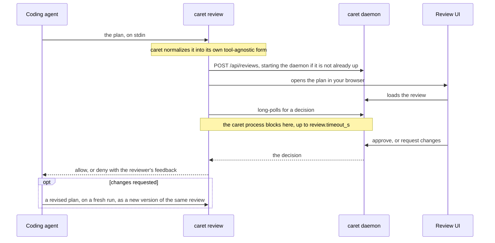

# caret — Architecture

*Audience: users and contributors who want caret's internals — the core/adapter boundary,
the agent adapters, the review tool, and the source layout.*

Part of the deep reference behind [README.md](../README.md). For what caret is, how to
install it, and basic usage, start there.

## How it works

Every plan makes the same round trip: your coding agent hands it to caret, caret serves it
to you in your browser from a loopback HTTP daemon on your own machine, and your decision
goes back to the agent as its answer.



> [!IMPORTANT]
> **Fail-safe = deny.** On a bad payload, an unreachable daemon, a timeout, a signal, or
> daemon death, caret emits `deny` with an explanation — it never auto-approves an
> unreviewed plan.

Your agent reaches caret through `bin/caret`, a small entrypoint shim that runs caret's
subcommands: Claude Code fires it as a hook, OpenCode's plugin spawns it from a tool. The
shim execs the platform-native compiled binary (`bin/caret-native`) when a
`mise run build` produced one, and otherwise runs the `bun` bundle (`dist/cli.js`) that
the marketplace and npm installs ship.

### Architecture: tool-agnostic core + agent adapter

caret is built around one boundary. A **tool-agnostic core** (everything in `src/`) owns
the daemon, the on-disk review store, the review/revision lifecycle, the settings service,
leveled logging, and the browser UI — none of it knows which coding agent is on the other
end. An **agent adapter** (`src/adapters/`) owns everything agent-specific: parsing the
agent's hook input, emitting the agent's decision response, declaring the approve variants
it offers, and probing the agent's local install for diagnostics. The core hands the
adapter raw hook stdin and a core decision; the adapter hands back a normalized plan and a
tool-specific stdout response. The dependency runs one way — an adapter imports core
types, never the reverse.

caret registers three adapters today. Claude's is the reference implementation the other
two are measured against. Pick one with `CARET_AGENT`; with no selector caret uses Claude,
so the shipped Claude plugin keeps working unchanged.

| Adapter | `CARET_AGENT` | How it wires in | What ships | Status |
| ------- | ------------- | --------------- | ---------- | ------ |
| **Claude Code** — `src/adapters/claude/` | `claude` (the default) | Three plan-mode hooks; the `PermissionRequest`/`ExitPlanMode` one intercepts the plan | The `caret@caret` plugin, from caret's own marketplace | Stable (default) |
| **OpenCode** — `src/adapters/opencode/` | `opencode` | An in-process plugin registering a `caret_review_plan` tool — OpenCode has no plan hook to intercept | The `@macintacos/caret` npm package, plus its own installer | Stable |
| **Codex CLI** — `src/adapters/codex/` | `codex` | A `PermissionRequest` hook | Nothing — no installer, no hook manifests | Provisional, default-off |

> [!WARNING]
> The Codex adapter's wire contract is modeled from Codex documentation and has never been
> verified against a live Codex session. It is there to prove the boundary is real, not to
> be relied on.

The hooks table and decision-JSON block below, and the behavioral prose in
`commands/*.md`, describe **Claude-adapter** surface — they are agent-specific, not core
behavior.

### The Claude Code adapter

caret wires into Claude Code through three plan-mode hooks:

| Hook                | Matcher         | Command           | Purpose                                                     |
| ------------------- | --------------- | ----------------- | ----------------------------------------------------------- |
| `PostToolUse`       | `EnterPlanMode` | `caret prewarm`   | Warm-start the daemon when the model enters plan mode.      |
| `PermissionRequest` | `ExitPlanMode`  | `caret review`    | Block, open the plan in the browser, return the decision.   |
| `PostToolUse`       | `ExitPlanMode`  | `caret reconcile` | Reconcile a plan decided in the terminal into the daemon.   |

The `PermissionRequest`/`ExitPlanMode` hook intercepts the plan-approval request itself,
so an **approve** auto-answers it (no native dialog) and a **request changes** returns the
feedback to the model, which revises and re-presents (captured as a new version). This was
verified empirically — `PreToolUse` does **not** work for this, because allowing the tool
to run still shows the native dialog.

The `PostToolUse`/`ExitPlanMode` hook (`caret reconcile`) fires when a plan is approved.
If the approval happened in Claude's own interface rather than caret's UI — so the daemon
still holds the review as pending — it resolves that review to keep the two surfaces in
sync. When the UI already resolved the plan (the normal case) it is a no-op, and it never
gates: any failure is silent, so a stalled reconcile can't block the agent.

The reviewer's approve choice is an opaque variant id the core stores and the UI renders;
the Claude adapter declares its variants (`default` / `acceptEdits` / `auto`) and rides
them to the UI over `GET /api/health`, so the approve split-button reflects the active
adapter's capabilities rather than hard-coded mode names. The adapter's skill enumeration
rides the same pattern one route over: `listSkills` walks the agent's own well-known
directories and the daemon serves the result on `GET /api/reviews/:id/skills`, which is
where the feedback editors' `/` completion reads the names a reviewer can cite. Both are
the same rule — a capability reaches the browser over the wire, never by importing an
adapter — so an agent that enumerates nothing simply yields an empty list and no
completion fires.

Skills reach the reviewer by two routes, not one. The enumeration only names them; a
second, on-demand route answers what a named skill actually does. When the reviewer
highlights an entry in the `/` list and opens the preview panel,
`GET /api/reviews/:id/skill-description` asks the adapter's `readSkillDescription` to open
that one skill's file and return the `description` from its frontmatter — nothing else
from the file crosses. The split is what keeps the list cheap: folding the description
into `listSkills` would open every skill's file on every `/` keystroke, to show one. A
skill with no description comes back empty and the panel says so, which is an ordinary
answer rather than an error. On a decision the adapter maps the chosen variant to a
session `setMode` permission and emits the resulting
[PermissionRequest decision](https://code.claude.com/docs/en/hooks) on stdout:

```jsonc
// approve (plain): no mode change
{ "hookSpecificOutput": { "hookEventName": "PermissionRequest",
  "decision": { "behavior": "allow" } } }
// approve & accept edits / & auto mode: switch the Claude session into that mode
{ "hookSpecificOutput": { "hookEventName": "PermissionRequest",
  "decision": { "behavior": "allow",
    "updatedPermissions": [{ "type": "setMode", "mode": "acceptEdits", "destination": "session" }] } } }
// request changes
{ "hookSpecificOutput": { "hookEventName": "PermissionRequest",
  "decision": { "behavior": "deny", "message": "<formatted annotations + comment>" } } }
```

**Why the review has a timeout.** The `caret review` hook long-polls the daemon for the
reviewer's decision, but Claude Code kills any hook that outruns its `timeout` budget —
and a killed `PermissionRequest` hook fails _open_, letting the plan proceed unreviewed.
So caret bounds its own wait with `review.timeout_s` (default 1 hour) and fail-safe-denies
when it elapses — a controlled deny that lands before Claude Code would kill the hook. To
guarantee that ordering, `review.timeout_s` is pinned strictly below the hook's `timeout`
(`3900` s in `hooks/hooks.json`); the schema rejects any value at or above it, and a
coupling test keeps the two numbers from drifting into the unsafe direction. The timeout
is therefore a requirement of the hook model — not a limit on how long you may take — so
raise `review.timeout_s` (up to just under 3900 s) if you want a longer window.

caret ships to Claude Code as the `caret@caret` plugin from its GitHub-based marketplace,
`macintacos/caret`. `caret install --target claude` drives Claude's own CLI to register
and install it — `claude plugin marketplace add macintacos/caret`, then
`plugin install caret@caret --scope user` and `plugin enable` — and the same install by
hand is `/plugin marketplace add macintacos/caret` + `/plugin install caret@caret` from
inside Claude Code, which is what the installer points you at when the `claude` CLI isn't
on your `PATH`. Re-running `caret install --refresh` is the update path — and for this
target the flag changes nothing, because the run always attempts an update: the
`marketplace add` is best-effort, but the `marketplace update caret` behind it is
unconditional, and a third phase runs `plugin update caret@caret --scope user` between two
`plugin list --json` reads, so the settled line reports the version Claude Code actually
moved from and to. Restart to apply. By hand the equivalents are
`claude plugin update caret@caret`, or `/plugin marketplace update caret` then
`/reload-plugins`. `caret install --uninstall --target claude` removes the plugin and
leaves that marketplace registration behind; `claude plugin marketplace remove caret`
clears it.

### The OpenCode adapter

OpenCode has no `ExitPlanMode` hook to intercept, so caret wires in as an
**in-process plugin** rather than a command hook. The plugin (shipped in the
`@macintacos/caret` package) registers a `caret_review_plan` tool and steers the Plan
agent to call it; the tool's `execute()` spawns `caret review` (`CARET_AGENT=opencode`)
with the plan on its stdin — the same entry point Claude's hook uses — blocks on your
decision in the browser, and returns an approval or a change request (the reviewer
feedback, without the plan echoed back) the agent revises and resubmits — see
[Calling the review tool from your own skill](#calling-the-review-tool-from-your-own-skill)
for who may call it and how to call it yourself. The whole daemon/review pipeline is
reused unchanged — the plugin is the OpenCode-side counterpart to Claude's `hooks.json`.
While the Plan agent is working, the plugin also warms the daemon in the background —
`caret prewarm` on each plan-agent message, mirroring the `caret prewarm` row in the
Claude hooks table above — so your first review doesn't wait on a cold start.

caret installs into OpenCode as a `plugin` array entry: `caret install --target opencode`
adds `@macintacos/caret` to your OpenCode config's `plugin` array (comment-preserving, via
`jsonc-parser`) and deploys the `/caret:*` command files, or you can add the array entry
by hand. Install and uninstall both remove the plugin and command files older caret
versions deployed into that config dir: OpenCode still loads them, so a leftover plugin
file would register a second review tool beside the array entry. The config dir's own
`package.json` is left alone — it may belong to another of your plugins. On its next start
OpenCode installs the package and its `@opencode-ai/plugin` dependency into its own cache
and loads it — caret writes no config-dir manifest and runs no `bun install` itself. The
plugin resolves the caret binary and its own version at runtime from the package it ships
in (`CARET_OPENCODE_BIN` overrides the binary — see
[Environment variables](CONFIGURING.md#environment-variables)), and on load it checks
caret's latest GitHub release and toasts an update nudge when you're behind
(`CARET_OPENCODE_NO_UPDATE_CHECK` opts out). `caret install --target claude` registers
caret with Claude Code through its plugin CLI, `--target opencode,claude` does both agents
at once, `--uninstall` reverses any target, and `--dry-run` previews the changes without
writing. See [`agents/opencode-integration.md`](agents/opencode-integration.md) for the
design.

`caret install --refresh` takes an update: it compares the caret OpenCode would load
against npm's published one, then either clears the stale cached copy so OpenCode
re-resolves on next start **or**, for a stale pinned entry, bumps the pin in the array in
place — a bump deliberately leaves the cache alone, since the new specifier gets its own
cache dir. A plain `caret install` runs the same check and asks first at a terminal; off
one, with no flag, it names the gap and the command that would close it and changes
nothing. Restart OpenCode afterward. Pinning `"@macintacos/caret@<version>"` in the array
and bumping it yourself is the other way to control which version loads. Clearing the
cache by hand is:

```sh
rm -rf ~/.cache/opencode/packages/@macintacos/caret*
```

> [!NOTE]
> The glob is load-bearing. OpenCode names one cache dir per **verbatim** specifier, so a
> bare `@macintacos/caret` entry and every pinned `@macintacos/caret@<version>` get
> separate dirs, and all of them have to go. Drop the `*` and the pinned dirs survive, so
> OpenCode reloads the stale copy from one of them.

Omit `--target` and `caret install` picks for you: it detects which agents you have
(`claude` on your PATH; `opencode` on your PATH or an existing OpenCode config dir) and
asks which to install into, with the detected ones pre-checked. Off a terminal — CI, a
pipe — it never waits on that prompt: it installs into every agent it detected, or into
Claude Code when it detected none, and says which. `--dry-run` previews that same choice
rather than asking, and `--uninstall` asks (or reports) the same way before removing.
`--target` is the way to pin the agents non-interactively. One more flag, `--from-local`,
is dev-only: it installs the caret checkout the binary was built in rather than the
published one — see [Development](DEVELOPMENT.md#development). Every install (but not
`--uninstall`) finishes by acquiring the rumdl plan formatter — it is part of installing
caret, not a step of its own — see
[Plan formatting](CONFIGURING.md#plan-formatting-rumdl).

At a terminal the whole run renders as one
[`@clack/prompts`](https://github.com/bombshell-dev/clack) session: the chooser, then a
spinner per operation (registering the marketplace, installing the plugin, editing
OpenCode's `plugin` array, deploying the command files, fetching rumdl) that settles into
a line saying what it did, and a closing summary. Off a terminal — piped, `CI=true`, or
`NO_COLOR` set — the same run reports as plain `caret: …` lines with no escape codes, so
CI transcripts and captured logs stay readable.

### Calling the review tool from your own skill

The review tool is **OpenCode-only** — it exists because caret wires into OpenCode as a
plugin, and a plugin can register tools, where Claude Code's adapter is a command hook
(`PermissionRequest`/`ExitPlanMode`) with nothing to call. Within OpenCode it is a plain
tool: a skill that wants a human decision before its work proceeds can ask for one
directly rather than waiting to be intercepted.

The call is `caret_review_plan`, and it takes a single argument, `plan` — the complete
plan, as markdown, to put in front of the reviewer. Session and working directory come
from the tool context, so there is nothing else to thread through.

It **blocks until you decide**. A change request comes back as the tool result: the
reviewer's feedback, plus an instruction to revise and call again. The plan itself is
deliberately not echoed back — the agent still holds it in its own tool-call arguments. A
feedback line reference indexes the plan version caret stored, and the abbreviated quote
paired with it is what the agent matches against its own text. That stored version is
reflowed to caret's 90-column shape at ingest (see
[Plan formatting](CONFIGURING.md#plan-formatting-rumdl)), so the numbers are caret's, not
yours. So the loop is call, read the feedback, revise, call again, until an approval
returns. An approval may carry reviewer notes of its own, in a clearly labeled section, to
fold in as the work proceeds; that is not another round, the plan is already approved.

The same **fail-safe = deny** rule holds where it matters, on the review decision itself:
a spawn failure, an unparseable decision, or a timeout (`review.timeout_s`, 1 hour by
default — see [Config file](CONFIGURING.md#config-file)) all come back as a change request
rather than an approval.

**Any primary agent may call it; subagents may not.** OpenCode doesn't fire plugin hooks
for subagent tool calls, so caret marks the review tool primary-only
(`experimental.primary_tools`, which OpenCode turns into a deny rule on every subagent
session) and re-checks in the tool body that the call didn't come from a subagent's child
session. Only the Plan agent is _steered_ toward the tool; every other primary agent has
to reach for it deliberately. One exception is worth knowing about: caret writes the
permission rescue for the `plan` agent alone, so a config with a global
`permission: { "*": "deny" }` keeps the tool there and loses it everywhere else. If your
skill is pinned to a non-plan agent, `caret_review_plan` is the route — OpenCode's own
`plan_exit` is permitted on the `plan` agent alone, so there is nothing to fall back on.

What you submit need not be a plan, and it need not come from a skill — mid-session on
`build`, you can simply ask for a review. The review UI renders any markdown, so a
migration checklist, a proposed schema, or a summary of what the agent is about to do all
go in front of a human the same way.

## Layout

```text
src/                tool-agnostic core, grouped by domain; the CLI entrypoint (cli.ts) and discovery report (discovery.ts) sit at the root
src/daemon/         the loopback HTTP daemon — request server, body validation, host/origin/CSRF/liveness guards, lifecycle, and client
src/review/         plan-review orchestration and the revision-threading state machine, with their store and decision/reconcile helpers
src/plan/           plan handling — the on-disk canonical plan, file-ref excerpts, cwd-rooted file search, fenced-block validation, and markdown reflow
src/redact/         log redaction — the browser-safe key walk and the node-side home-path scrub
src/ui/             the daemon's bridge to the embedded Svelte UI — asset resolution and the log endpoint
src/config/         settings, preferences, resolved paths, and shared constants
src/lib/            cross-cutting foundation — wire-contract types, logging, and small shared utilities
src/commands/       per-subcommand entrypoints (one file per subcommand)
src/adapters/       the coding-agent adapter axis — the AgentAdapter interface and registry, plus one directory per tool (claude · opencode · codex)
ui/                 Svelte 5 multi-asset SPA (Vite) embedded into the binary via the build-generated asset manifest, served by the daemon by URL path · src/state/ runes state modules · src/icons/ vendored Lucide SVGs
hooks/              hooks.json (PermissionRequest/ExitPlanMode + PostToolUse/EnterPlanMode + PostToolUse/ExitPlanMode) — Claude-adapter packaging
commands/           /caret:demo · /caret:debug · /caret:discovery — Claude-adapter packaging (agent-specific behavioral prose)
opencode/           the plugin OpenCode loads — the review tool, the planning steer, the config-hook mutation, and commands/ (the same three commands, rewritten for OpenCode) — OpenCode-adapter packaging
test/               core/ (tool-agnostic suites) · adapters/<tool>/ (per-adapter suites + fixtures) · opencode/ (the repo-root opencode/ package) · e2e/ (Playwright) · structure/ (repo-shape invariants) · scripts/ (release + dev tooling) · support/ (shared scaffolding)
scripts/            dev and release tooling for the checkout, plus the caret entrypoint shim's test
bin/                the caret entrypoint shim (bin/caret) — the only tracked file here; a local build drops the compiled binary and the UI assets beside it
```

The polished diff/compare viewer for plan versions is a planned fast-follow.
