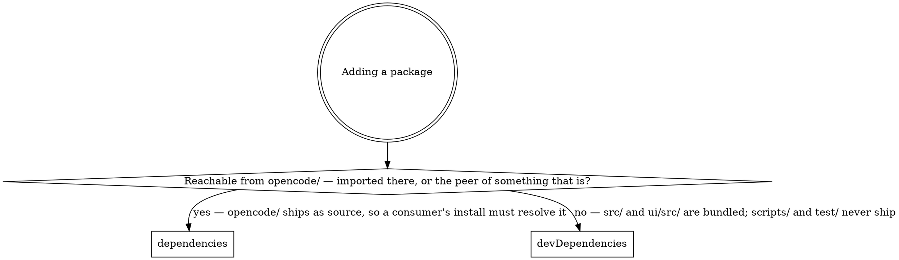

# Dependency Rules

*Audience: coding agents and contributors adding, moving, or removing a package in
`package.json`.*

Almost nothing caret ships resolves an npm specifier. Both shipped programs are bundles,
so a package's section in [`../../package.json`](../../package.json) is decided by what
the **published artifact** loads — not by whether production source imports it.

## What actually ships

`package.json`'s `files` array publishes `dist/`, `ui/dist/`, `bin/caret`, `hooks/`,
`commands/`, `opencode/`, and `.claude-plugin/plugin.json`.

- **`dist/cli.js`** is a `bun build --target=bun` bundle
  ([`../../scripts/tasks/build.ts`](../../scripts/tasks/build.ts)) that inlines every npm
  package. The only bare specifiers left in it are node builtins.
- **`ui/dist`** is a Vite bundle — static assets, no module resolution at runtime.
- **`bin/caret`** is a bash shim over `bin/caret-native`, `dist/cli.js`, or `src/cli.ts`.
  `src/` is not in `files`, so the last target exists only in a dev checkout.
- **`opencode/`** is the one directory shipped as unbundled TypeScript, so its imports are
  the only ones a consumer's package manager has to resolve.

This is not free to get wrong: OpenCode installs the package
**and its declared `dependencies`** into its own cache (see
[`opencode-integration.md`](opencode-integration.md)), as does `npm i @macintacos/caret`.
A build input filed as a runtime dependency is downloaded by every user and loaded by
none.

## Where a new package goes

The diamond asks about reachability rather than imports because a peer obligation has no
import site of its own: it belongs wherever the package that declares the peer belongs.

**The manifest does not match this yet.** Most of `dependencies` is build-time input that
belongs in `devDependencies`; only `@opencode-ai/plugin` is correctly placed.
[EXC-1086](https://linear.app/macintacos/issue/EXC-1086/reclassify-build-time-only-dependencies-to-devdependencies)
carries the move. Until it lands, place new packages by the rule above rather than by
copying a neighbour.

## Three reasons a package with no imports is still live

`grep` for the specifier is necessary and not sufficient. Each of these is a real entry
caret depends on today, and each has zero import sites:

- **A peer obligation.** `@internationalized/date` exists only to satisfy `bits-ui`'s
  non-optional peer range; `commander` only to satisfy `@commander-js/extra-typings`'.
- **A program run by name rather than imported.**
  `@laststance/tailwind-suggest-canonical-classes` and `svelte-check` are invoked through
  `bunx` from [`../../hk.pkl`](../../hk.pkl); `pino-pretty` is spawned as a child process
  by `scripts/tasks/dev/run.ts` to render the dev log tail.
- **Types for a library that ships none.** `@types/semver` — `semver` itself declares no
  `types` field.

Before calling anything unused, check all three.

## Replacing a dependency with our own code

The bar is: our version would be **meaningfully** smaller, we would actually maintain it,
and the dependency's edge cases are not doing work we would have to redo anyway. Usage
count alone does not clear it — a package imported once can still be carrying a conflict
table, a grammar, or a parser we do not want to own.

Never hand-roll away a package that guards a trust boundary purely to reduce the
dependency count: `xss` (sanitising agent-authored markdown), `zod` and `smol-toml`
(validating `config.toml`), and `jsonc-parser` (editing the user's OpenCode config without
destroying their comments) all stay.

## Pinning

Version ranges are the upgrade policy; `bun.lock` is what pins. An exact version therefore
means "never move this on a sweep", takes a `bun install` afterwards so the lockfile
records it, and **must** carry its reason in `package.json`'s `pinned` block —
[`../../test/structure/exact-pin.test.ts`](../../test/structure/exact-pin.test.ts) fails
by name on an undocumented pin, an empty reason, or an entry left behind after its package
was removed or de-pinned. That block's own `//` note is the policy; don't restate it
elsewhere.
