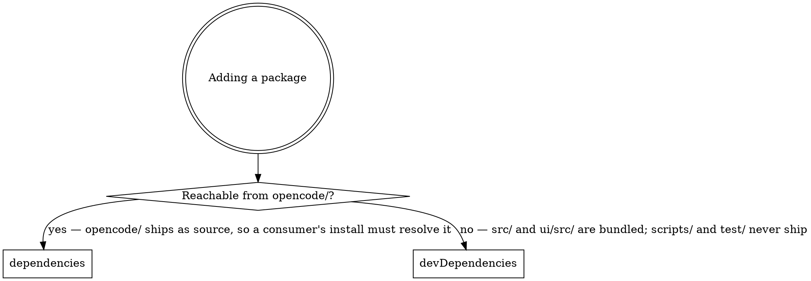

# Dependency Rules

*Audience: coding agents and contributors adding, moving, or removing a package in
`package.json`.*

Almost nothing caret ships resolves an npm specifier. The CLI and the UI both ship as
bundles, so a package's section in [`../../package.json`](../../package.json) is decided
by what the **published artifact** loads — not by whether production source imports it.
(`ui/package.json` is a stub for shadcn-svelte's CLI and holds no dependencies; the root
manifest is the only one.)

## What actually ships

`package.json`'s `files` array publishes `dist/`, `ui/dist/`, `bin/caret`,
`bin/caret-launcher`, `hooks/`, `commands/`, `opencode/`, and
`.claude-plugin/plugin.json`. The last three are JSON and Markdown data — they load
nothing.

- **`dist/cli.js`** is a `bun build --target=bun` bundle
  ([`../../scripts/tasks/build.ts`](../../scripts/tasks/build.ts)) that inlines every npm
  package: no package name survives in it, only node builtins and caret's own `@/` alias
  for the generated UI manifest — a dynamic import the bundle tolerates missing.
- **`ui/dist`** is a Vite bundle — static assets, no module resolution at runtime.
- **`bin/caret`** is a bash shim over `bin/caret-native`, `dist/cli.js`, or `src/cli.ts`.
  Neither `bin/caret-native` nor `src/` is in `files`, so an npm install always lands on
  `dist/cli.js`; the other two branches exist for a build-from-source or dev checkout.
- **`bin/caret-launcher`** is the only shipped file that is *copied out* of the package
  rather than run from inside it: `caret install` writes it to a stable path under the
  state dir, where a service unit names it and it resolves whichever caret is live.
- **`opencode/`** is the one directory shipped as unbundled TypeScript, so its imports are
  the only ones a consumer's package manager has to resolve.

This is not free to get wrong: OpenCode installs the package
**and its declared `dependencies`** into its own cache (see
[`opencode-integration.md`](opencode-integration.md)), as does `npm i @macintacos/caret`.
A build input filed as a runtime dependency is downloaded by every user and loaded by
none.

## Where a new package goes

*Reachable* means imported from `opencode/`, or a **non-optional** peer of something that
is — a peer obligation has no import site of its own, so it belongs wherever the package
declaring it belongs. Optional peers are not reachable: `@opencode-ai/plugin` declares
three `@opentui/*` peers as optional, which is why caret declares none of them.

[`../../test/structure/dependency-placement.test.ts`](../../test/structure/dependency-placement.test.ts)
is the falsifier: it derives the reachable set from `opencode/`'s own imports and fails on
a `dependencies` that holds anything else, so a package placed by copying a neighbour reds
on the push that adds it. A **reachable** peer obligation has no import site to derive, so
it would go in the suite's expected set by hand; the header records that condition and why
the term is empty today.

## Four shapes a package with no imports still takes

`grep` for the specifier is necessary and not sufficient. Each of these is a real entry
caret depends on today, and none has a TypeScript import site:

- **A peer obligation.** `@internationalized/date` exists only to satisfy `bits-ui`'s
  non-optional peer range; `commander` only to satisfy `@commander-js/extra-typings`'.
- **A program run by name rather than imported.** `svelte-check` and
  `@laststance/tailwind-suggest-canonical-classes` are invoked from
  [`../../hk.pkl`](../../hk.pkl) — the latter as the bare binary
  `tailwind-suggest-canonical-classes`, so the package name appears nowhere in that file.
  `pino-pretty` is spawned as a child process by `scripts/tasks/dev/run.ts` to render the
  dev log tail.
- **A stylesheet imported from CSS.** `tw-animate-css` and `tailwindcss` reach the build
  through `@import` in `ui/src/app.css`, which no TypeScript search covers.
- **Types for a library that ships none.** `@types/semver` — `semver` itself declares no
  `types` field.

These are the shapes caret has today, not a closed set. Before calling anything unused,
rule out every one of them and then look for a fifth.

## Replacing a dependency with our own code

The bar is: our version would be **meaningfully** smaller, we would actually maintain it,
and the dependency's edge cases are not doing work we would have to redo anyway. Usage
count alone does not clear it — a package imported once can still be carrying a conflict
table, a grammar, or a parser we do not want to own.

Never hand-roll away a package that guards a trust boundary purely to reduce the
dependency count: `xss` (sanitising agent-authored markdown), `zod` and `smol-toml`
(validating `config.toml`), and `jsonc-parser` (editing the user's OpenCode config without
destroying their comments) all stay.

## Pinning and holding

Version ranges are the upgrade policy; `bun.lock` is what pins — everywhere but the
`dependencies` block: `bun.lock` is not in `files`, so a consumer resolving
`@opencode-ai/plugin`'s `^1.18.17` has no lock behind it, and that floor is a
minimum-supported claim, not a pin. Two blocks in `package.json` annotate a range that is
doing something deliberate, each with its own gate, and each failing **by name** on an
entry that outlived what it described:

- **`pinned`** — an exact version, meaning "never move this on a sweep". Takes a
  `bun install` afterwards so the lockfile records it, and must carry its reason.
  [`../../test/structure/exact-pin.test.ts`](../../test/structure/exact-pin.test.ts) fails
  on an undocumented pin, an empty reason, or an entry left behind after its package was
  removed or de-pinned. The `@pierre/diffs` entry has a second gate that lives in the
  build rather than the unit suite: the `caret-bundle-budget` vite plugin in
  [`../../ui/bundle-budget.ts`](../../ui/bundle-budget.ts) fails `vite build` once
  `ui/dist` grows past a recorded budget. That budget covers the `shiki/wasm` and
  `@pierre/theme/` alias entries — one that stops matching grows the bundle by +622,310 or
  +334,084 bytes — and deliberately not the bare `/^shiki$/` entry, which grows it by only
  +10,741 bytes because it swaps behaviour rather than keeping a payload out.
- **`held`** — a range deliberately stopping below the current major, with the evidence
  and the condition that lifts it. Its one entry, `typescript`, records a
  **peer obligation** rather than a blocked upgrade: the tree type-checks with TypeScript
  7 through the `@typescript/native` alias, and `^6` stays because svelte-check needs both
  majors installed and because two suites under `test/structure/` import the compiler API
  as a parser.
  [`../../test/structure/typescript-arrangement.test.ts`](../../test/structure/typescript-arrangement.test.ts)
  is its falsifier, and it reds when that peer range widens.

Removing or moving a dependency means checking **both** blocks for an entry that no longer
names anything. Each block's own `//` note is its policy; don't restate them elsewhere.

The lockfile has a falsifier of its own:
[`../../test/structure/dependency-dedupe.test.ts`](../../test/structure/dependency-dedupe.test.ts)
runs `bun dedupe --check` and reds on any duplicate version bun can collapse onto a
version `bun.lock` already names; the fix is `bun dedupe` at the repo root, then commit
the rewritten `bun.lock`. What no gate catches is the sweep itself: on Bun 1.4
`bun update` saves to `package.json` by default, rewriting every `^` floor to the version
it resolved, and `bun dedupe --check` accepts any manifest its lock agrees with — so a
lockfile-only sweep ends with `git checkout -- package.json && bun install`.
