# Documentation Rules

*Audience: coding agents and contributors making **documentation** changes in caret.*

`CLAUDE.md` routes a **code** change to the rule file that governs it. This file is the
mirror for **docs**: it maps every piece of documentation caret ships and decides
*which one* a given change should update. Reach for it whenever you are about to write or
edit prose — a feature's user docs, a contributor note, a new rule-of-the-road — and
aren't sure where it belongs.

Like `CLAUDE.md`'s router, read the digraph as a checklist, not a single path: a change
can touch several docs at once, so **update every doc whose edge matches**. Each box links
onward to a pointer file under [`references/`](references/) that says *how* to edit that
doc; those are loaded on demand, not all at once.

## Routing

```graphviz
digraph caret_docs_router {
    "Changing documentation" [shape=doublecircle];
    "Which doc does the change affect?" [shape=diamond];

    "Edit README.md" [shape=box];
    "Edit doc/ADVANCED.md" [shape=box];
    "Edit CONTRIBUTING.md" [shape=box];
    "Edit CLAUDE.md" [shape=box];
    "Edit a doc/agents/*.md rule file" [shape=box];
    "Edit doc/README.md" [shape=box];
    "Edit CHANGELOG.md (via /release-caret)" [shape=box];

    "Changing documentation" -> "Which doc does the change affect?";
    "Which doc does the change affect?" -> "Edit README.md" [label="user-facing front door: what caret is, install, basic usage, pointers onward"];
    "Which doc does the change affect?" -> "Edit doc/ADVANCED.md" [label="advanced/contributor reference: build-from-source, architecture, adapter internals, full config + CARET_* tables, dev workflow, logging"];
    "Which doc does the change affect?" -> "Edit CONTRIBUTING.md" [label="human contributor onboarding: local setup, the mise workflow, where tests live"];
    "Which doc does the change affect?" -> "Edit CLAUDE.md" [label="the code-change routing index, plus the CodeGraph / verifying-changes prose"];
    "Which doc does the change affect?" -> "Edit a doc/agents/*.md rule file" [label="a rule-of-the-road for a code area (architecture, logging, TS, Svelte, shadcn, testing, icons, settings, OpenCode)"];
    "Which doc does the change affect?" -> "Edit doc/README.md" [label="the index of the doc/ directory itself"];
    "Which doc does the change affect?" -> "Edit CHANGELOG.md (via /release-caret)" [label="release history — owned by the release flow, not hand-edited mid-feature"];
}
```

## The doc landscape

- **`README.md`** (repo root) — the lean, user-facing front door: what caret is, install,
  basic usage, and pointers onward. It leads with the install audience; the advanced and
  contributor-facing depth lives in `doc/ADVANCED.md`, which it links to. How to edit it:
  [`references/readme.md`](references/readme.md).
- **`doc/ADVANCED.md`** — the deep, human-facing reference behind `README.md`:
  build-from-source, the core/adapter architecture, the Claude Code and OpenCode adapter
  internals, the full `config.toml` + `CARET_*` tables, and the development workflow. It
  holds the advanced material the README points to. How to edit it:
  [`references/advanced.md`](references/advanced.md).
- **`CONTRIBUTING.md`** (repo root) — the short, human-facing front door for people who
  want to develop caret: `bun install`, the `mise` task workflow, and where tests live. It
  stays minimal and points at `README.md`, `doc/ADVANCED.md`, and `doc/agents/` for depth.
  How to edit it: [`references/contributing.md`](references/contributing.md).
- **`CLAUDE.md`** (repo root) — the agent-facing router for **code** changes, plus the
  CodeGraph and verifying-changes guidance. Adding or moving a `doc/agents/*.md` rule file
  means adding or updating its edge here. How to edit it:
  [`references/claude-md.md`](references/claude-md.md).
- **`doc/agents/*.md`** — the rules-of-the-road: one file per code area, the substance
  behind `CLAUDE.md`'s digraph. This routing reference lives among them. How to add or
  edit one: [`references/agent-rules.md`](references/agent-rules.md).
- **`doc/README.md`** — the index of the `doc/` directory: what lives here and why. How to
  edit it: [`references/doc-readme.md`](references/doc-readme.md).
- **`CHANGELOG.md`** (repo root) — keep-a-changelog release history, owned by the
  `/release-caret` flow rather than hand-edited during a feature. How it is maintained:
  [`references/changelog.md`](references/changelog.md).

## Audience, stated at the top of every new doc

`CLAUDE.md`, `doc/README.md`, the `doc/agents/*.md` rule files, and this file's
`references/` pointers are **agent-facing**. `README.md`, `CONTRIBUTING.md`, and
`doc/ADVANCED.md` are **human-facing** — `doc/ADVANCED.md` is the one human-facing doc
that lives under `doc/`, whose other contents are agent-facing. State the audience
explicitly at the top of each new doc so a reader knows in one line whether it is written
for them.

## Prose passes: use `/doc-coauthoring`

Drive substantive prose edits through the `/doc-coauthoring` skill rather than ad-hoc
drafting. It walks the audience, the reader's goal, structure, and a readability pass —
which is exactly what keeps these docs scannable and on-audience. The pointer files repeat
this call-out per doc.

## The maintenance rule

Documentation drifts when the map and the docs are edited in separate changes. So:
**adding, removing, or renaming a doc updates, in the same change,**

1. **this map** — the digraph above and the doc-landscape entry, and
2. **its `CLAUDE.md` routing edge**, if the doc is a `doc/agents/*.md` rule file with one,
   and
3. **its pointer file** under [`references/`](references/).

A doc that exists without a place on this map is a doc no one will find.
