# Plan Render Rules

*Audience: coding agents and contributors changing how a plan is rendered —
`ui/src/lib/diffview/` and the `SourceView` / `DiffPlanView` components.*

caret renders a plan as **line-numbered markdown source**, not as rendered HTML. Every
decoration the reviewer sees is drawn over the characters they would copy. This file is
the contract the whole `ui/src/lib/diffview/` layer shares; each module's own header
carries only what is local to it.

## Transform in place (EXC-855)

**Markers stay in the text and are marked, not removed.** Emphasis markers, backticks,
task brackets, quote markers and list bullets are all still there in the DOM; the sheet
overdraws them. That is what keeps the row's gutter number, its hover comment affordance
and its cursor reachability intact, and what makes copy, `/` search, vim motions and
comment anchors all resolve against the same column space.

Three constructs are allowed out of it, and no more:

- **Link collapse** (`links.ts`) — `[label](target)` collapses to `label` and `<url>` to
  `url`. This is the only display rewrite in the layer, and therefore the only reason a
  display column ever differs from a source column.
- **Tables** (`tables.ts`) — the one construct that **restructures** rather than
  overdrawing, because a row's `|` columns do not line up with the table's columns and
  alignment has to come from layout. No character is added, removed or moved.
- **Images** (`inlineImages.ts`) — the picture is **added** to the row, never substituted
  for it. The literal `` stays, so copy carries the real markdown.

Reaching for a fourth exception means changing this file first.

## The pipeline

```graphviz
digraph plan_render {
    rankdir=LR;
    "plan text" [shape=note];
    "links.ts" [shape=box];
    "inlineSpans.ts" [shape=box];
    "inlineDecorate.ts" [shape=box];
    "coreStyles.ts" [shape=box];

    "plan text" -> "links.ts" [label="per line"];
    "links.ts" -> "inlineSpans.ts" [label="display text"];
    "inlineSpans.ts" -> "inlineDecorate.ts" [label="flat runs"];
    "inlineDecorate.ts" -> "coreStyles.ts" [label="tagged tokens"];
}
```

- **`links.ts`** is the one per-line pass over plan text. It returns display text plus
  five layers keyed by display line: clickable link spans, file references, flat inline
  runs, blockquote depth, and images.
- **`inlineSpans.ts`** emits the flat atomic runs for one display line — one span per
  element-bounded stretch of identical attribute set. Runs are **flat by requirement**,
  not by style: a nested wrapper would break the token partition below. Abutting elements
  are never fused, because that boundary is where a pill's rounded end gets drawn.
- **`inlineDecorate.ts`** refines shiki's tokens until none straddles a run boundary, then
  tags each with the run covering it.
- **`coreStyles.ts`** turns each attribute into one CSS rule. The ink and chip vocabulary
  it draws from is `svelte-rules.md`'s, not this file's.

The block classifiers — `codeBlocks.ts`, `tables.ts`, `thematicBreaks.ts` — and the
reference scanner `fileRefs.ts` run alongside, each answering "which lines are this
construct" and tagging the rows the library painted. Their DOM tagging lives in the module
rather than the component so it is unit-testable against a constructed fixture.

## Line parity

**Every transform is strictly per-line, and the output always has the same line count as
the input.** Lines are processed independently and rejoined with `\n`. The annotation and
feedback line numbers depend on it: a pass that dropped or added a line would silently
move every comment anchor below it.

## Display coordinates

**Every layer indexes the display text** — the space the reader actually sees — and line
numbers are 1-based, matching the view's per-line `data-line`. Because `links.ts` is the
only pass that rewrites, it is also the only pass that has to think about the
display/source divergence; everything downstream reads display columns and needs no
remapping of its own.

## The token partition

`rowTokens.ts` owns what "a row's tokens" means, and both halves of it are load-bearing:

- **`splitTokens` only ever refines.** Every boundary shiki drew survives a split, so
  every column a later pass looks for is still a token boundary.
- **`tokenChildren` is how a row's tokens are reached** — the row's own children, or a
  table row's cells' children one level down. It exists so no pass has to know which kind
  of row it is looking at.

Every pass locates a token by walking that sequence and accumulating text length.
**No pass may introduce a nested wrapper**: it would break the partition and put an
attribute on an element spanning more than the thing it names.

## Idempotency is a hard requirement

`SourceView.svelte` drives these passes from `MutationObserver`s, so a pass that redoes
settled work loops the observer forever. The two observers have different rules and the
difference matters:

- **The repaint observer** watches `childList` over the whole subtree. Node creation and
  splitting are therefore conditional — an already-correct row is left completely
  untouched. **Attribute writes are free**, because attributes are not observed.
- **The selection observer** watches `attributeFilter: ["data-selected-line"]`. Here a
  write of an *unchanged* value still emits a MutationRecord, so `cardSelection.ts` must
  never write a value that is already there.

Library-owned rows are rewritten on every repaint, so a pass that tags them is also
replayed from the repaint pass, against a non-reactive mirror.

## marked is the grammar of record

The inline and block grammars come from `marked`, already a UI dependency. Reuse its lexer
rather than hand-rolling a scanner: it is what makes nested emphasis, emphasis inside link
labels, escaped markers, setext underlines spelled `---`, table delimiter rows, fenced
`---`, and a break interrupting a list all come out right. A hand-rolled equivalent would
be the fiddliest parser in the repo for a strictly worse answer.

**Where caret's own fence scan and marked disagree, the panel wins.** `codeBlocks.ts`
toggles on every line of three or more backticks, which CommonMark does not, so on a plan
quoting nested fences the two disagree about which rows are code. marked is right, but the
panel is what the reader sees — a rule drawn inside one would read as a bug. Classifiers
take the fenced ranges as a parameter for exactly this reason.

## Safety

`links.ts` owns the scheme gate and it is absolute: only an `http`/`https` target is ever
emitted as clickable or drawable, and no downstream module re-decides safety. A
path-shaped target collapses but records **no** clickable span — `openUrl` must never be
handed a filesystem path. Every other scheme (`javascript:`, `data:`, `mailto:`, the
protocol-relative `//host/…` form, a scheme-less host) stays literal source text, so the
reader can see what the link would actually do.

Rendering an image makes the reviewer's browser fetch an arbitrary host when the row
scrolls into view. `referrerpolicy` and `loading` reduce what leaks; they do not close the
channel. Closing it wants an `img-src` CSP on the daemon's own response, which does not
exist today.
