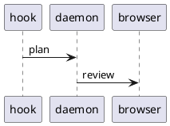

# caret dev — markdown rendering stress test

<!--
Keep this comment BELOW the h1: review titles derive from the plan's first non-empty line
(deriveTitle, src/review/threading.ts), so a comment above the heading becomes the title.

Write this file the way an agent writes a plan: every paragraph and every list item on
ONE long line, wrapped nowhere. Do not hand-wrap it, and do not run rumdl over it.

It is excluded from the repo's markdown tooling on purpose (.rumdl.toml `exclude`, and
`exclude` on both rumdl steps in hk.pkl). caret reflows every incoming plan at ingest
through its own config (src/plan/rumdl.ts), and this file is the input that reflow is
tested against — so it has to arrive unformatted, as real agent output does. Wrapping it
here would pre-break lines under a config with no reflow exemptions, and caret's reflow
never rejoins a line something else already broke, so the fixture would quietly stop
testing anything.

The plan view shows stored plan text as markdown SOURCE, so this comment is visible in
the UI. That is fine — it belongs to the fixture.
-->


> **This is a local `mise run dev` fixture, not a real plan.** It exists to exercise every markdown rendering path in the review webview — headings, lists, tables, code highlighting, sanitization, and overflow — so visual regressions show up at a glance. Look for the **`local build`** badge in the top bar; if you see it, you're looking at this seed.

The renderer is `marked` (GFM on, `breaks` off) → DOMPurify (strict allowlist) → Shiki (dual-theme). The sections below each target a slice of that pipeline. Edit this file and the dev driver reseeds it, so it doubles as a live scratchpad for renderer work.

## Headings

The first heading in the document is normalized to an `h1` regardless of its authored level; every heading below keeps its level so the heading breadcrumbs trail and scrollspy have a full ladder.

### Heading level three

Body copy under an `h3`. Headings should keep comfortable vertical rhythm and not collide with the paragraph that follows them.

#### Heading level four

Body copy under an `h4`.

##### Heading level five

Body copy under an `h5`.

###### Heading level six

Body copy under an `h6` — the deepest level, often rendered close to body size.

The section below carries the heading *tree*, as opposed to this one's ladder of levels.

## Heading navigation

**Everything under this heading is invented.** The subsystems, modules, owners and numbers below are fixture data — none of it describes anything caret does, ships, or plans to. It is scaffolding for the heading breadcrumbs bar (EXC-946/EXC-957), which needs a hierarchy worth walking: the tree nests six levels deep, fans out wider than a menu can show at once, repeats a name under two different parents, skips a level, and carries headings long, short and strange enough to push the trail through every state it has. Open the bar with `b`, walk it with `h`/`j`/`k`/`l`, jump with Enter, and filter every heading in the plan with `/`.

### Fake subsystem: Ferris telemetry

The deep branch. Reading the innermost heading under it puts six crumbs in the bar — more than a narrow window holds, so the middle collapses behind the elision marker and comes back as the window widens.

#### Intake

Two stages sit below, so this crumb's menu opens on a pair of siblings rather than a single row.

##### Decode

The stage that supposedly turns a fake wire payload into fake records.

###### Verify the checksum

The deepest heading in the plan — level six, with a sibling beside it, so the bottom of the walk is a menu rather than a dead end.

###### Stamp the arrival clock

Sibling of the step above: same level, same parent, one line apart.

##### Fan out

A stage with nothing under it, so its row is a plain destination rather than a doorway into a submenu.

#### Retention

Exactly one heading sits under this one — the narrowest menu the bar ever draws.

##### Compact the fake archive

The only child of Retention.

### Fake subsystem: Carousel billing

Ten siblings sit under this heading, enough that its menu scrolls instead of showing every row at once. The ledger below is invented too, down to the last decimal.

| Fake ledger      | Owner | Records | Drift |
| ---------------- | ----- | ------: | ----: |
| carousel-invoice | avery |  12,904 |  0.2% |
| carousel-refund  | blair |   1,338 |  1.7% |
| carousel-dunning | casey |     412 |  0.0% |
| carousel-payout  | devon |   8,067 |  0.4% |

#### Invoices

Fake module one of ten.

#### Refunds

Fake module two of ten.

#### Dunning

Fake module three of ten.

#### Proration

Fake module four of ten.

#### Credits

Fake module five of ten.

#### Taxes

Fake module six of ten.

#### Payouts

Fake module seven of ten.

#### Chargebacks

Fake module eight of ten.

#### Statements

Fake module nine of ten.

#### Reconciliation

Fake module ten of ten — the last row of a menu that had to scroll to reach it.

### Fake subsystem: Bumper-car routing

Two probes live here: a heading whose text repeats one from Carousel billing, and a level the tree skips outright.

#### Invoices

The second heading in the plan called "Invoices". The filter (`/`) names the enclosing heading beside each row, which is the only thing telling this one from its namesake under Carousel billing; their anchors differ too, the later occurrence taking a `-1` suffix.

###### Verify the checksum

A level-six heading directly under a level four: no level five was ever opened, so this roots at Invoices above rather than at anything between them. It repeats a name from the Ferris branch as well, giving the filter a second pair to keep apart.

### Fake subsystem: Odd headings

The shapes that are awkward to *render* rather than awkward to nest.

#### A fake heading whose text runs on well past the width any crumb can show, so the bar has to truncate it with an ellipsis and the menu row does the same, while the whole string stays in the hover title

Long enough to collapse the trail on its own, even in a wide window.

#### Fee

About as short as a heading gets — useful beside the monster above for watching how the bar hands out width.

#### `reconcileFakeLedger()` — a heading carrying inline code

Heading text is read from the plan SOURCE, so the backticks travel into the crumb and the menu row rather than rendering as code there; only the heading in the plan body renders them.

#### 🎡 🎠 🎢

No letters or digits at all: slugifying leaves nothing behind, so the anchor falls back to `section`.

#### Closing hashes are stripped ####

ATX closing hashes are trimmed off the heading text, so the crumb reads without the trailing `####`.

#### Ünïcödé, 你好, مرحبا

Mixed scripts in one heading, to confirm the crumb, the menu row and the anchor all survive them.

A `#` inside a fence is code, not a heading, so nothing in the block below should ever reach the bar:

```text
# Not a heading
## Also not a heading
```

## Inline formatting

A paragraph with **bold**, *italic*, ***bold italic***, `inline code`, and ~~strikethrough~~ text, plus a [relative link](#tables), an [external link](https://example.com/docs/markdown), and a bare autolink https://example.com/autolinked?q=1&lang=en that GFM should turn into an anchor.

Inline code can hold awkward characters: `const re = /^\s*#{1,6}\s+/g;` and `rm -rf "$dir"/*.tmp`.

A footnote-style reference[^1] and an inline image:


[^1]: Footnotes are not GFM core, so this likely renders inline as literal text — a useful
    negative
case to confirm nothing crashes on an unsupported construct.

## Lists

Unordered, nested four levels deep:

- Top level item with **emphasis**
  - Second level
    - Third level with `code`
      - Fourth level — the deepest rung
- Back to the top level
  - A sibling with a [jump to the code blocks section](#code-blocks)

Ordered, with a nested unordered list and a restart:

1. First step
2. Second step
   - a sub-point
   - another sub-point
3. Third step
   1. nested ordered
   2. nested ordered two

Task list (GFM). Note: the `<input type="checkbox">` markup is **stripped by DOMPurify** (it is not on the tag allowlist), so these render as plain items — an intentional sanitizer demonstration:

- [x] Build the daemon
- [x] Serve the UI
- [ ] Ship the badge
- [ ] Write the stress test

## Blockquotes

> A single-level blockquote with **bold** and a `code span`.

Nested, three levels deep:

> Outer quote.
>
> > Nested quote, second level.
> >
> > > Third level, with a list inside:
> > >
> > > - quoted item one
> > > - quoted item two

## Tables

Column alignment — left, center, right:

| Feature        | Status      |   Coverage |
| :------------- | :---------: | ---------: |
| Headings       |   shipped   |       100% |
| Code highlight |   shipped   |        92% |
| Footnotes      | unsupported |         0% |
| Task lists     |   partial   |        50% |

A deliberately **wide** table to exercise horizontal scrolling / overflow handling:

| id  | name              | language | lines |  added | removed | owner | reviewed | merged | tags                      |
| --- | ----------------- | -------- | ----: | -----: | ------: | ----- | -------- | ------ | ------------------------- |
| 1   | parser refactor   | ts       |  1284 |    902 |     382 | avery | yes      | yes    | core, parser, perf        |
| 2   | shiki integration | ts       |   640 |    640 |       0 | blair | yes      | no     | ui, highlight, deps       |
| 3   | redaction core    | ts       |   311 |    280 |      31 | casey | yes      | yes    | security, logging, shared |
| 4   | daemon lifecycle  | ts       |   998 |    540 |     458 | devon | no       | no     | core, daemon, lock        |

## Code blocks

Inline first: call `renderPlan(markdown)` then `sanitize(html)`.

TypeScript:

```ts
export interface HealthIdentity {
  service?: string;
  version?: string;
  isDev?: boolean; // EXC-556 — drives the "local build" badge
}

export function isCompiledBinary(): boolean {
  return !process.argv[1]?.endsWith(".ts");
}
```

JavaScript:

```js
const sum = (xs) => xs.reduce((a, b) => a + b, 0);
console.log(sum([1, 2, 3, 4]));
```

Bash:

```bash
#!/usr/bin/env bash
set -euo pipefail
for f in "$@"; do
  printf 'processing %s\n' "$f"
done
```

JSON:

```json
{
  "service": "caret",
  "version": "1.2.3",
  "isDev": true,
  "approveVariants": [{ "id": "default", "label": "Approve" }]
}
```

Python:

```python
def fib(n: int) -> int:
    a, b = 0, 1
    for _ in range(n):
        a, b = b, a + b
    return a
```

Rust:

```rust
fn main() {
    let total: i32 = (1..=10).filter(|n| n % 2 == 0).sum();
    println!("sum of evens = {total}");
}
```

Lua — outside the old scoped bundle, so it rendered plain before EXC-665; it must now highlight like the rest:

```lua
-- iterative fibonacci
local function fib(n)
  local a, b = 0, 1
  for _ = 1, n do
    a, b = b, a + b
  end
  return a
end

print("fib(10) = " .. fib(10))
```

A unified diff:

```diff
   router.get("/", home);
   router.get("/login", login);
+  router.get("/api/health", health);
-  router.get("/api/legacy", legacy);
```

SQL:

```sql
SELECT id, title, status
FROM reviews
WHERE status = 'pending'
ORDER BY created_at DESC
LIMIT 20;
```

YAML:

```yaml
logging:
  level: info
  redact: false
daemon:
  port: 42718
```

CSS:

```css
.dev-badge {
  background: var(--accent);
  color: var(--accent-ink);
  border-radius: 99px;
}
```

A `text` fence — non-code content (a directory tree). Per the plan-format rule, non-code blocks are tagged `text` so they never count as untagged:

```text
caret/
├── src/
│   ├── daemon.ts
│   └── build-id.ts
└── ui/
    └── src/
        └── components/
            └── DevBadge.svelte
```

Console output, also `text`:

```text
$ mise run dev
==> daemon listening on 127.0.0.1:42719
==> seeded review: caret dev — markdown rendering stress test
==> vite ready on http://localhost:5173
```

An **unrecognized language** — caret now bundles shiki's full grammar set (EXC-665), so this plain-fallback path only fires for a tag shiki has no grammar for at all (here PlantUML — shiki ships no `plantuml` grammar). It must still fall back to a plain `<pre><code>` without crashing:



Very long lines (EXC-729) — a code block whose lines run well past the panel's width. Per the fix these must stay **inside** the panel and scroll horizontally: the whole block scrolls as one unit so the aligned columns stay aligned, and a line must never wrap or break out of the code block's background. Scroll the longest line to its end — the shorter lines follow it, while the short `project.yml` row (which fits) stays put:

```text
Sieve/App/SieveApp.swift              @main App, WindowGroup { RootView() } — installs the root scene, its window styling, and the shared AppModel every feature module reads
Sieve/UI/RootView.swift               placeholder View — Text("Sieve"), min 480x320, wired into a NavigationSplitView shell so the sidebar and detail panes exist before any real screens land
Sieve/Features/.gitkeep               empty group placeholders (kept in git) so the feature folders survive a clean checkout, then get replaced one screen at a time as each is built
Sieve/Support/Info.plist              CFBundleName Sieve, display name, copyright, LSMinimumSystemVersion 15.0, plus the custom URL scheme and background-modes stubs the sync engine needs
SieveTests/PlaceholderTests.swift     Swift Testing @Test #expect(true) — proves the test action is wired end to end through the scheme before any real assertions or fixtures exist
project.yml                           XcodeGen spec
```

## Horizontal rules

Text above the rule.

---

Text between two rules.

---

Text below the rule.

## Overflow and edge cases

A very long unbroken token that must wrap or scroll rather than blow out the layout: `supercalifragilisticexpialidocious_pneumonoultramicroscopicsilicovolcanoconiosis_antidisestablishmentarianism_floccinaucinihilipilification`

A long URL in a link: [a very long query string](https://example.com/search?q=markdown+rendering+stress+test&category=ui&sort=relevance&page=1&per_page=100&include=headings,tables,code,quotes&debug=true).

A long inline-code run: `const ALL_THE_THINGS = ["alpha","bravo","charlie","delta","echo","foxtrot","golf","hotel","india","juliett","kilo","lima","mike"];`

Unicode and emoji: café, naïve, Ω≈ç√∫, 你好, مرحبا, 🚀 ✅ ⚠️ — confirming the font stack and direction handling don't break.

A paragraph that is simply long, to check measure and line-height across a wide column: the quick brown fox jumps over the lazy dog, and then the quick brown fox jumps over the lazy dog again, and once more for good measure, until the paragraph is comfortably longer than a single visual line on most viewports and wrapping behavior becomes observable.

## Reflow exemptions

Every case below arrives on one unwrapped line, the way an agent emits it, and caret reflows it at ingest to 90 columns with a link's URL exempt from that measurement — a URL nobody can break should not fragment the sentence around it. The exemption is from measurement only, so a line carrying a link settles wider than 90 and scrolls rather than wrapping.

Read each link case as a whole sentence: the prose around the link should stay with it rather than being pushed onto its own line. Two cases are expected to break anyway. Case 1's *visible* link text alone exceeds 90, and only the URL is exempt, never the link text. Case 2's inline code span is not exempt either — `code-spans` is left at its default, so a long span still counts against the budget and lands on its own line with the sentence split around it.

**1. Link text past 90.** [a link whose visible text alone runs well past ninety columns before its URL is even measured](https://example.com/reflow/long-text) and prose trailing after it.

**2. Long code span mid-sentence.** Prose ahead of the span, `const EXEMPTIONS = ["reflow-length-exemptions", "ignore-link-urls", "code-spans"] as const;` and prose behind it.

**3. Bare autolink.** https://example.com/reflow/autolink?q=exemption&cols=90&mode=normalize followed by a few words.

**4. Reference link.** A [reference-style link][reflow-ref] whose definition sits at the end of this section.

**5. In a list item.**

- [a long link inside a list item](https://example.com/reflow/list-item?cols=90&mode=normalize) and trailing prose on the same item.

**6. In a table cell.**

| Case | Link                                                                                        |
| ---- | ------------------------------------------------------------------------------------------- |
| Cell | [a long link in a table cell](https://example.com/reflow/table-cell?cols=90&mode=normalize) |

**7. Image with a long URL.**


**8. Short link, long line.** A link comfortably under ninety characters [such as this one](https://example.com/reflow/short) that still carries its line past the budget on the strength of the prose around it.

[reflow-ref]: https://example.com/reflow/reference-definition?cols=90&mode=normalize

## Sanitizer probes

The block below is shown **as source** (inside a tagged `html` fence) so you can read what is being attempted — it is highlighted, not executed:

```html
<script>alert("xss")</script>
<iframe src="https://evil.example.com"></iframe>
<a href="#" onclick="steal()">click me</a>
<div style="position: fixed; inset: 0; z-index: 9999">overlay</div>
```

Below, the same markup appears **raw** so DOMPurify actually processes it live. Expected: the `<script>` and `<iframe>` are removed entirely, the `onclick` handler and the `position: fixed` style are stripped (only Shiki dual-theme styles survive the style hook), while the anchor text and plain content remain.

<script>alert("xss")</script>
<iframe src="https://evil.example.com"></iframe>
<a href="#" onclick="steal()">a sanitized link</a>
<div style="position: fixed; inset: 0; z-index: 9999">this should not pin to the viewport</div>

If anything in the paragraph above escapes the sanitizer — an alert fires, an iframe loads, or the overlay covers the page — that is a real security regression in `ui/src/lib/render.ts`.

## Filename references

EXC-687: a filename written in **inline code** that resolves to a real file under the review's working directory gets a small file icon to its left, and clicking the reference opens a syntax-highlighted excerpt of that file — the head of the file, or a window centered on the referenced line when the reference carries a `:line`. The affordance is scoped to inline code (a bare-prose path renders as one coarse token with nowhere to hang the icon), and a path that does not resolve stays completely inert — no icon, no preview — so a made-up reference never masquerades as a link.

The list below points at long-lived files, and leans on paths and line numbers that stay meaningful as their contents drift, so the check keeps working as the tree around it changes. Every path needs a known extension to be tagged at all, which is why extensionless files like `LICENSE` are absent. Click each to verify:

- `package.json` — a real file: shows the icon; the preview opens on the head of the file.
- `README.md` — another real file, for a second icon to eyeball beside the first.
- `README.md:37` — the same file with a line: the excerpt is centered on line 37 (a ±30-line window) instead of the head, and that line is marked and already in view — no scrolling to find it.
- `README.md:3` — a line near the top: the window clamps at line 1, so a bottom strip shows and there is **no** top strip.
- `mise.toml` — a file shorter than the 60-line opening window: the whole file shows, with **no** strips on either side, and the header reads a plain line count instead of a range.
- `mise.toml:900` — a line far past the end: the window clamps to the last line rather than opening empty, and **nothing** is marked, since the cited line doesn't exist.
- `doc/ADVANCED.md:300` — a long file opened mid-way, so both strips carry large counts. Click `↑` and `↓` repeatedly to walk the window out to line 1 and to the last line; each strip disappears when its side runs out, and an upward click should not throw away the line you were reading.
- `src/cli.ts` — real source rather than config: a line too long for the drawer scrolls sideways inside the excerpt rather than being cut off, and dragging the drawer's inner edge wider brings more of it into view.
- `src/does-not-exist.ts` — a path deliberately **not** in the repo: it must show **no** icon and **no** preview. If it ever sprouts one, the existence gate has regressed.

---

## Out of scope

This fixture renders only; there is nothing to approve here. Use **Request changes** to watch the dev driver thread a revision onto this plan, or **Approve** to have it reseed a fresh copy.
