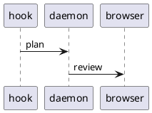

# caret dev — markdown rendering stress test

<!--
Keep this comment BELOW the h1: review titles derive from the plan's first non-empty line
(deriveTitle, src/review/threading.ts), so a comment above the heading becomes the title.

Write this file the way an agent writes a plan: every paragraph and every list item on
ONE long line, wrapped nowhere. Do not hand-wrap it, and do not run rumdl over it.

It is excluded from the repo's markdown tooling on purpose (.rumdl.toml `exclude`, and
`exclude` on both rumdl steps in hk.pkl). caret reflows every incoming plan at ingest
through its own config (src/plan/rumdl.ts), and this file is the input that reflow is
tested against — so it has to arrive unformatted, as real agent output does. Wrapping it
here would pre-break lines under a config with no reflow exemptions, and caret's reflow
never rejoins a line something else already broke, so the fixture would quietly stop
testing anything.

The plan view shows stored plan text as markdown SOURCE, so this comment is visible in
the UI. That is fine — it belongs to the fixture.

Three invariants bind edits to this file. The first two are enforced by
test/scripts/dev-driver.test.ts:

1. The COUNT OF FENCE LINES must stay even. codeBlockRanges (ui/src/lib/diffview/
codeBlocks.ts) toggles in and out of code on every line matching /^\s*(`{3,}|~{3,})/,
without regard to length or fence character, so an odd count leaves everything from the
last fence to the end of this file rendering inside a code panel.

2. Some spans of this file are reproduced VERBATIM in DEMO_EDITS (scripts/tasks/dev/
protocol.ts), which rewrites them to build the earlier draft versions. Editing one means
editing that copy in the same change; the drift guard fails loudly if you don't.

3. This file is SEEDED BY AN E2E SPEC (test/e2e/showcase.e2e.ts), which drives it in a real
browser and asserts that every construct the plan view decorates still draws. It finds its
rows by the decoration they carry and by where they sit relative to each other, never by
their wording, with ONE exception: its search case types the heading "Rendering showcase".
So rewording prose is free, renaming that heading is not, and deleting a construct from the
Rendering showcase reds the spec — which is the point. Note that the preflight gate does
NOT run `test e2e` for a Markdown-only diff, so that red arrives on the full gate rather
than on the narrowed one.
-->


> **This is a local `mise run dev` fixture, not a real plan.** It exists to exercise every markdown rendering path in the review webview — headings, lists, tables, code highlighting, sanitization, and overflow — so visual regressions show up at a glance. Look for the **`local build`** badge in the top bar; if you see it, you're looking at this seed.

The renderer is `marked` (GFM on, `breaks` off) → DOMPurify (strict allowlist) → Shiki (dual-theme). The sections below each target a slice of that pipeline. Edit this file and the dev driver reseeds it, so it doubles as a live scratchpad for renderer work.

## Headings

The first heading in the document is normalized to an `h1` regardless of its authored level; every heading below keeps its level so the heading breadcrumbs trail and scrollspy have a full ladder.

### Heading level three

Body copy under an `h3`. Headings should keep comfortable vertical rhythm and not collide with the paragraph that follows them.

#### Heading level four

Body copy under an `h4`.

##### Heading level five

Body copy under an `h5`.

###### Heading level six

Body copy under an `h6` — the deepest level, often rendered close to body size.

The section below carries the heading *tree*, as opposed to this one's ladder of levels.

## Heading navigation

**Everything under this heading is invented.** The subsystems, modules, owners and numbers below are fixture data — none of it describes anything caret does, ships, or plans to. It is scaffolding for the heading breadcrumbs bar (EXC-946/EXC-957), which needs a hierarchy worth walking: the tree nests six levels deep, fans out wider than a menu can show at once, repeats a name under two different parents, skips a level, and carries headings long, short and strange enough to push the trail through every state it has. Open the bar with `b`, walk it with `h`/`j`/`k`/`l`, jump with Enter, and filter every heading in the plan with `/`.

### Fake subsystem: Ferris telemetry

The deep branch. Reading the innermost heading under it puts six crumbs in the bar — more than a narrow window holds, so the middle collapses behind the elision marker and comes back as the window widens.

#### Intake

Two stages sit below, so this crumb's menu opens on a pair of siblings rather than a single row.

##### Decode

The stage that supposedly turns a fake wire payload into fake records.

###### Verify the checksum

The deepest heading in the plan — level six, with a sibling beside it, so the bottom of the walk is a menu rather than a dead end.

###### Stamp the arrival clock

Sibling of the step above: same level, same parent, one line apart.

##### Fan out

A stage with nothing under it, so its row is a plain destination rather than a doorway into a submenu.

#### Retention

Exactly one heading sits under this one — the narrowest menu the bar ever draws.

##### Compact the fake archive

The only child of Retention.

### Fake subsystem: Carousel billing

Ten siblings sit under this heading, enough that its menu scrolls instead of showing every row at once. The ledger below is invented too, down to the last decimal.

| Fake ledger      | Owner | Records | Drift |
| ---------------- | ----- | ------: | ----: |
| carousel-invoice | avery |  12,904 |  0.2% |
| carousel-refund  | blair |   1,338 |  1.7% |
| carousel-dunning | casey |     412 |  0.0% |
| carousel-payout  | devon |   8,067 |  0.4% |

#### Invoices

Fake module one of ten.

#### Refunds

Fake module two of ten.

#### Dunning

Fake module three of ten.

#### Proration

Fake module four of ten.

#### Credits

Fake module five of ten.

#### Taxes

Fake module six of ten.

#### Payouts

Fake module seven of ten.

#### Chargebacks

Fake module eight of ten.

#### Statements

Fake module nine of ten.

#### Reconciliation

Fake module ten of ten — the last row of a menu that had to scroll to reach it.

### Fake subsystem: Bumper-car routing

Two probes live here: a heading whose text repeats one from Carousel billing, and a level the tree skips outright.

#### Invoices

The second heading in the plan called "Invoices". The filter (`/`) names the enclosing heading beside each row, which is the only thing telling this one from its namesake under Carousel billing; their anchors differ too, the later occurrence taking a `-1` suffix.

###### Verify the checksum

A level-six heading directly under a level four: no level five was ever opened, so this roots at Invoices above rather than at anything between them. It repeats a name from the Ferris branch as well, giving the filter a second pair to keep apart.

### Fake subsystem: Odd headings

The shapes that are awkward to *render* rather than awkward to nest.

#### A fake heading whose text runs on well past the width any crumb can show, so the bar has to truncate it with an ellipsis and the menu row does the same, while the whole string stays in the hover title

Long enough to collapse the trail on its own, even in a wide window.

#### Fee

About as short as a heading gets — useful beside the monster above for watching how the bar hands out width.

#### `reconcileFakeLedger()` — a heading carrying inline code

Heading text is read from the plan SOURCE, so the backticks travel into the crumb and the menu row rather than rendering as code there; only the heading in the plan body renders them.

#### 🎡 🎠 🎢

No letters or digits at all: slugifying leaves nothing behind, so the anchor falls back to `section`.

#### Closing hashes are stripped ####

ATX closing hashes are trimmed off the heading text, so the crumb reads without the trailing `####`.

#### Ünïcödé, 你好, مرحبا

Mixed scripts in one heading, to confirm the crumb, the menu row and the anchor all survive them.

A `#` inside a fence is code, not a heading, so nothing in the block below should ever reach the bar:

```text
# Not a heading
## Also not a heading
```

## Inline formatting

A paragraph with **bold**, *italic*, ***bold italic***, `inline code`, and ~~strikethrough~~ text, plus a [relative link](#tables), an [external link](https://example.com/docs/markdown), and a bare autolink https://example.com/autolinked?q=1&lang=en that GFM should turn into an anchor.

Inline code can hold awkward characters: `const re = /^\s*#{1,6}\s+/g;` and `rm -rf "$dir"/*.tmp`.

A footnote-style reference[^1] and an inline image:


[^1]: Footnotes are not GFM core, so this likely renders inline as literal text — a useful
    negative
case to confirm nothing crashes on an unsupported construct.

## Lists

Unordered, nested four levels deep:

- Top level item with **emphasis**
  - Second level
    - Third level with `code`
      - Fourth level — the deepest rung
- Back to the top level
  - A sibling with a [jump to the code blocks section](#code-blocks)

Ordered, with a nested unordered list and a restart:

1. First step
2. Second step
   - a sub-point
   - another sub-point
3. Third step
   1. nested ordered
   2. nested ordered two

Task list (GFM). Note: the `<input type="checkbox">` markup is **stripped by DOMPurify** (it is not on the tag allowlist), so these render as plain items — an intentional sanitizer demonstration:

- [x] Build the daemon
- [x] Serve the UI
- [ ] Ship the badge
- [ ] Write the stress test

## Blockquotes

> A single-level blockquote with **bold** and a `code span`.

Nested, three levels deep:

> Outer quote.
>
> > Nested quote, second level.
> >
> > > Third level, with a list inside:
> > >
> > > - quoted item one
> > > - quoted item two

## Tables

Column alignment — left, center, right:

| Feature        | Status      |   Coverage |
| :------------- | :---------: | ---------: |
| Headings       |   shipped   |       100% |
| Code highlight |   shipped   |        92% |
| Footnotes      | unsupported |         0% |
| Task lists     |   partial   |        50% |

A table whose last column carries prose long enough to wrap inside its own column, while the two beside it keep their natural width:

| Step | Owner | Notes |
| ---- | ----- | ----- |
| 1 | avery | Drain the queue before the cutover, then hold the relay closed until the health probe has reported two consecutive green intervals. |
| 2 | blair | Short. |
| 3 | casey | Roll back by re-opening the relay and replaying the parked batch — the parser refactor changed the on-disk shape, so the replay has to run through the new decoder rather than the one that wrote them. |

A deliberately **wide** table to exercise horizontal scrolling / overflow handling:

| id  | name              | language | lines |  added | removed | owner | reviewed | merged | tags                      |
| --- | ----------------- | -------- | ----: | -----: | ------: | ----- | -------- | ------ | ------------------------- |
| 1   | parser refactor   | ts       |  1284 |    902 |     382 | avery | yes      | yes    | core, parser, perf        |
| 2   | shiki integration | ts       |   640 |    640 |       0 | blair | yes      | no     | ui, highlight, deps       |
| 3   | redaction core    | ts       |   311 |    280 |      31 | casey | yes      | yes    | security, logging, shared |
| 4   | daemon lifecycle  | ts       |   998 |    540 |     458 | devon | no       | no     | core, daemon, lock        |

## Code blocks

Inline first: call `renderPlan(markdown)` then `sanitize(html)`.

TypeScript:

```ts
export interface HealthIdentity {
  service?: string;
  version?: string;
  isDev?: boolean; // EXC-556 — drives the "local build" badge
}

export function isCompiledBinary(): boolean {
  return !process.argv[1]?.endsWith(".ts");
}
```

JavaScript:

```js
const sum = (xs) => xs.reduce((a, b) => a + b, 0);
console.log(sum([1, 2, 3, 4]));
```

Bash:

```bash
#!/usr/bin/env bash
set -euo pipefail
for f in "$@"; do
  printf 'processing %s\n' "$f"
done
```

JSON:

```json
{
  "service": "caret",
  "version": "1.2.3",
  "isDev": true,
  "approveVariants": [{ "id": "default", "label": "Approve" }]
}
```

Python:

```python
def fib(n: int) -> int:
    a, b = 0, 1
    for _ in range(n):
        a, b = b, a + b
    return a
```

Rust:

```rust
fn main() {
    let total: i32 = (1..=10).filter(|n| n % 2 == 0).sum();
    println!("sum of evens = {total}");
}
```

Lua — outside the old scoped bundle, so it rendered plain before EXC-665; it must now highlight like the rest:

```lua
-- iterative fibonacci
local function fib(n)
  local a, b = 0, 1
  for _ = 1, n do
    a, b = b, a + b
  end
  return a
end

print("fib(10) = " .. fib(10))
```

A unified diff:

```diff
   router.get("/", home);
   router.get("/login", login);
+  router.get("/api/health", health);
-  router.get("/api/legacy", legacy);
```

SQL:

```sql
SELECT id, title, status
FROM reviews
WHERE status = 'pending'
ORDER BY created_at DESC
LIMIT 20;
```

YAML:

```yaml
logging:
  level: info
  redact: false
daemon:
  port: 42718
```

CSS:

```css
.dev-badge {
  background: var(--accent);
  color: var(--accent-ink);
  border-radius: 99px;
}
```

A `text` fence — non-code content (a directory tree). Per the plan-format rule, non-code blocks are tagged `text` so they never count as untagged:

```text
caret/
├── src/
│   ├── daemon.ts
│   └── build-id.ts
└── ui/
    └── src/
        └── components/
            └── DevBadge.svelte
```

Console output, also `text`:

```text
$ mise run dev
==> daemon listening on 127.0.0.1:42719
==> seeded review: caret dev — markdown rendering stress test
==> vite ready on http://localhost:5173
```

An **unrecognized language** — caret now bundles shiki's full grammar set (EXC-665), so this plain-fallback path only fires for a tag shiki has no grammar for at all (here PlantUML — shiki ships no `plantuml` grammar). It must still fall back to a plain `<pre><code>` without crashing:



Very long lines (EXC-729) — a code block whose lines run well past the panel's width. Per the fix these must stay **inside** the panel and scroll horizontally: the whole block scrolls as one unit so the aligned columns stay aligned, and a line must never wrap or break out of the code block's background. Scroll the longest line to its end — the shorter lines follow it, while the short `project.yml` row (which fits) stays put:

```text
Sieve/App/SieveApp.swift              @main App, WindowGroup { RootView() } — installs the root scene, its window styling, and the shared AppModel every feature module reads
Sieve/UI/RootView.swift               placeholder View — Text("Sieve"), min 480x320, wired into a NavigationSplitView shell so the sidebar and detail panes exist before any real screens land
Sieve/Features/.gitkeep               empty group placeholders (kept in git) so the feature folders survive a clean checkout, then get replaced one screen at a time as each is built
Sieve/Support/Info.plist              CFBundleName Sieve, display name, copyright, LSMinimumSystemVersion 15.0, plus the custom URL scheme and background-modes stubs the sync engine needs
SieveTests/PlaceholderTests.swift     Swift Testing @Test #expect(true) — proves the test action is wired end to end through the scheme before any real assertions or fixtures exist
project.yml                           XcodeGen spec
```

## Horizontal rules

Text above the rule.

---

Text between two rules.

---

Text below the rule.

## Overflow and edge cases

A very long unbroken token that must wrap or scroll rather than blow out the layout: `supercalifragilisticexpialidocious_pneumonoultramicroscopicsilicovolcanoconiosis_antidisestablishmentarianism_floccinaucinihilipilification`

A long URL in a link: [a very long query string](https://example.com/search?q=markdown+rendering+stress+test&category=ui&sort=relevance&page=1&per_page=100&include=headings,tables,code,quotes&debug=true).

A long inline-code run: `const ALL_THE_THINGS = ["alpha","bravo","charlie","delta","echo","foxtrot","golf","hotel","india","juliett","kilo","lima","mike"];`

Unicode and emoji: café, naïve, Ω≈ç√∫, 你好, مرحبا, 🚀 ✅ ⚠️ — confirming the font stack and direction handling don't break.

A paragraph that is simply long, to check measure and line-height across a wide column: the quick brown fox jumps over the lazy dog, and then the quick brown fox jumps over the lazy dog again, and once more for good measure, until the paragraph is comfortably longer than a single visual line on most viewports and wrapping behavior becomes observable.

## Reflow exemptions

Every case below arrives on one unwrapped line, the way an agent emits it, and caret reflows it at ingest to 90 columns with a link's URL exempt from that measurement — a URL nobody can break should not fragment the sentence around it. The exemption is from measurement only, so a line carrying a link settles wider than 90 and scrolls rather than wrapping.

Read each link case as a whole sentence: the prose around the link should stay with it rather than being pushed onto its own line. Two cases are expected to break anyway. Case 1's *visible* link text alone exceeds 90, and only the URL is exempt, never the link text. Case 2's inline code span is not exempt either — `code-spans` is left at its default, so a long span still counts against the budget and lands on its own line with the sentence split around it.

**1. Link text past 90.** [a link whose visible text alone runs well past ninety columns before its URL is even measured](https://example.com/reflow/long-text) and prose trailing after it.

**2. Long code span mid-sentence.** Prose ahead of the span, `const EXEMPTIONS = ["reflow-length-exemptions", "ignore-link-urls", "code-spans"] as const;` and prose behind it.

**3. Bare autolink.** https://example.com/reflow/autolink?q=exemption&cols=90&mode=normalize followed by a few words.

**4. Reference link.** A [reference-style link][reflow-ref] whose definition sits at the end of this section.

**5. In a list item.**

- [a long link inside a list item](https://example.com/reflow/list-item?cols=90&mode=normalize) and trailing prose on the same item.

**6. In a table cell.**

| Case | Link                                                                                        |
| ---- | ------------------------------------------------------------------------------------------- |
| Cell | [a long link in a table cell](https://example.com/reflow/table-cell?cols=90&mode=normalize) |

**7. Image with a long URL.**


**8. Short link, long line.** A link comfortably under ninety characters [such as this one](https://example.com/reflow/short) that still carries its line past the budget on the strength of the prose around it.

[reflow-ref]: https://example.com/reflow/reference-definition?cols=90&mode=normalize

## Sanitizer probes

The block below is shown **as source** (inside a tagged `html` fence) so you can read what is being attempted — it is highlighted, not executed:

```html
<script>alert("xss")</script>
<iframe src="https://evil.example.com"></iframe>
<a href="#" onclick="steal()">click me</a>
<div style="position: fixed; inset: 0; z-index: 9999">overlay</div>
```

Below, the same markup appears **raw** so DOMPurify actually processes it live. Expected: the `<script>` and `<iframe>` are removed entirely, the `onclick` handler and the `position: fixed` style are stripped (only Shiki dual-theme styles survive the style hook), while the anchor text and plain content remain.

<script>alert("xss")</script>
<iframe src="https://evil.example.com"></iframe>
<a href="#" onclick="steal()">a sanitized link</a>
<div style="position: fixed; inset: 0; z-index: 9999">this should not pin to the viewport</div>

If anything in the paragraph above escapes the sanitizer — an alert fires, an iframe loads, or the overlay covers the page — that is a real security regression in `ui/src/lib/render.ts`.

## Filename references

EXC-687: a filename written in **inline code** that resolves to a real file under the review's working directory gets a small file icon to its left, and clicking the reference opens a syntax-highlighted excerpt of that file — the head of the file, or a window framed on the lines the reference cites when it carries a `:line` or a `:start-end` range. A bare path in prose is not detected here — backticks are how a plan says "this is a path", and scanning bare prose would tag ordinary words — and a path that does not resolve stays completely inert — no icon, no preview — so a made-up reference never masquerades as a link. Inline code is one of two ways to write a reference; markdown links are the other, below.

The list below points at long-lived files, and leans on paths and line numbers that stay meaningful as their contents drift, so the check keeps working as the tree around it changes. Every path needs a known extension to be tagged at all, which is why extensionless files like `LICENSE` are absent. Click each to verify:

- `package.json` — a real file: shows the icon; the preview opens on the head of the file.
- `README.md` — another real file, for a second icon to eyeball beside the first.
- `README.md:37` — the same file with a line: the excerpt is centered on line 37 (a ±30-line window) instead of the head, and that line is marked and already in view — no scrolling to find it.
- `README.md:3` — a line near the top: the window clamps at line 1, so a bottom strip shows and there is **no** top strip.
- `mise.toml` — a file shorter than the 60-line opening window: the whole file shows, with **no** strips on either side, and the header reads a plain line count instead of a range.
- `mise.toml:900` — a line far past the end: the window clamps to the last line rather than opening empty, and **nothing** is marked, since the cited line doesn't exist.
- `doc/DEVELOPMENT.md:124` — a long file opened mid-way, so both strips carry large counts. Click `↑` and `↓` repeatedly to walk the window out to line 1 and to the last line; each strip disappears when its side runs out, and an upward click should not throw away the line you were reading.
- `src/cli.ts` — real source rather than config: a line too long for the drawer scrolls sideways inside the excerpt rather than being cut off, and dragging the drawer's inner edge wider brings more of it into view.
- `src/does-not-exist.ts` — a path deliberately **not** in the repo: it must show **no** icon and **no** preview. If it ever sprouts one, the existence gate has regressed.

### Folder references

EXC-918: a reference that resolves to a **directory** gets a folder glyph rather than a file one, and clicking it opens an interactive tree rooted at that path — its immediate children, collapsed, fetched one level at a time as you open folders. Files in the tree are inert: clicking one does nothing. Escape closes the card, as does a click anywhere outside it, but a click **inside** it does not, so the tree can be navigated. The card is honest about what it is not showing: a level wider than the daemon's cap says how many rows it elided, and a directory the daemon declines to enumerate says `not listed` when you open it instead of appearing empty.

- `src` — the repo's own source root: the folder glyph, and a card whose first level is `src/`'s immediate children. Open `daemon` or `plan` inside it to watch a level arrive; each one is its own round trip.
- `ui/src/icons` — a directory of nothing but files, so every row in it is inert. Clicking any of them must do nothing at all.
- `ui` — its level holds `dist`, a directory the daemon declines to enumerate. It is a row like any other, so the card matches what is on disk, but opening it reports `not listed` rather than thousands of build outputs. The same goes for `node_modules` and for any dotted name.
- `doc/agents` — a small directory, useful beside `src` for seeing the card at its shortest.
- `src/does-not-exist` — a directory deliberately **not** in the repo: **no** glyph, and nothing on click. The same existence gate the missing file above tests, on the other kind.

### Line ranges

EXC-938: a reference can cite a **span** rather than a single line, and the preview frames the whole of it — every cited line washed, the usual context around it, and the end-line tail inside the click target rather than dangling outside it. Click the last character of each reference below, not its path, to check that half.

- `doc/DEVELOPMENT.md:154-162` — nine cited lines: all nine are washed as one band, and the window reaches 30 lines past the span at each end rather than starting where the citation does.
- `README.md:3-9` — a span near the file's head: the window clamps at line 1 instead of asking for a line before it, so the preview opens on the file rather than degrading to a head view.
- `src/cli.ts:10-110` — a span taller than the panel: it opens parked on its **first** line rather than centred, so reading starts where the citation does; the rest is a scroll away.
- `mise.toml:5-900` — a span running past the end: it clamps to the last line, and only the lines that exist are washed.
- `README.md:37-37` — a one-line span: identical to writing `README.md:37`.
- `README.md#L37-L44` and `README.md:L37-L44` — the same span in the `#L` spellings a code host would produce. Both parse; `README.md:37:5` is still a line and a **column**, so it marks one row and no range.
- `doc/DEVELOPMENT.md:154,162` — the comma spelling of the span the first bullet writes with a dash, and it must open on exactly the same nine washed lines. The separator is the only difference: a comma reads as a selection an editor would hand you, so a plan that pastes one cites a range rather than falling back to the head of the file. `README.md:37,37` collapses to a single line the same way `README.md:37-37` does.

### As markdown links

EXC-954: a markdown link whose **target** is a path is a reference too. The link collapses to its label — brackets and parens gone, the path never written twice — and the label becomes the click target for the same preview. Nothing here is a web link: a filesystem path is never handed to the browser, so none of these open a tab.

Where the **icon** lands is the thing to look at, and it follows the token the label leaves behind. A backticked label keeps its backticks, so the path stays its own token and takes the icon anywhere on the line. A bare-path or prose label collapses into ordinary prose, and it takes the icon too: the decoration pass cuts the row at the reference's own columns, so the label is its own element and the chip hugs it rather than the sentence.

Each bullet below carries exactly one link and no other reference, so whatever icons you count on a line came from that link alone. Hover each to confirm the chip hugs the filename and never the sentence:

- [`package.json`](package.json) — a backticked-path label, the citation shape caret's own plans use. It keeps its backticks and their inline-code styling, and shows **exactly one** icon: both detection paths fire on this shape, so a second icon here would be a regression.
- Mid-sentence, [`README.md`](README.md) still takes its icon, because the backticks give it a token of its own wherever it sits.
- [README.md](README.md) — a bare-path label. The path shows, plainly styled, and takes the icon exactly as the backticked rows above do: the decoration pass cuts the row at the reference's own columns, so even a collapsed bare label has a token of its own for the glyph to sit on. Clicking the words opens the preview.
- [the caret dev workflow](doc/DEVELOPMENT.md) — a prose label: the words survive and the path does not appear at all. Hovering reveals the target in a tooltip, the only way to see where the click goes.
- [the deep middle of a long file](doc/DEVELOPMENT.md:124) — a target carrying a line number: opens centered on line 124 with both strips showing, and the tooltip carries the line as well as the path.
- [a stretch of the dev guide](doc/DEVELOPMENT.md:226-238) — a target carrying a **range**: the label hides it entirely, so the tooltip is the only place the span is visible before the click, and the preview washes all thirteen lines.
- [`mise.toml`](package.json) — a label and target that **disagree**: the click opens the target, never the file the label names. Read the tooltip before clicking. The icon still sits inside the backticks.
- [a plan that moved](doc/does-not-exist.md) — an unresolved target: the label reads as plain prose with no icon, no chip, and no preview, and its line still opens a comment composer on click.
- [docs](guide) — a single extensionless segment: the brackets come off like any link's, but it is **not a citation** — no icon, no tooltip, no preview. It could be a directory, but nothing in the text says so, and that is decided before anything resolves.
- [the bundle](ftp://example.com/lib.ts) — a target carrying a scheme: also stays literal. It ends in a known extension, but a URL slot is not a path, and resolving it against the repo would preview an unrelated local file.
- [the caret repo](https://github.com/macintacos/caret) — an ordinary http link, unchanged: no icon, and clicking it opens a tab.

EXC-956: a link whose target is a **directory** collapses on exactly the same terms, and the click opens the folder tree rather than a file preview. Kind is never read off the target's spelling — `doc/agents` and `doc/agents/` are one citation, and the daemon is what tells a directory from a file. What this layer decides, before anything resolves, is only whether the target is a citable path: made of path characters alone, resolvable in principle, and specific enough to be worth an icon and a preview — which means more than one segment, or one segment naming a file by extension. A path-shaped target that fails that test still collapses; it just reads as an ordinary link rather than a reference.

- [`doc/agents/`](doc/agents/) — a backticked-path directory label: the **folder** glyph rather than the file one, and a click that opens the tree rooted there. Set it beside the file rows above; nothing differs but the glyph and the surface.
- [the agent rules](doc/agents) — the same directory behind a prose label and written without the slash: the same card on click, and the path visible only in the tooltip. The **folder** glyph lands here too: the decoration pass cuts the row at the reference's own columns, and for a collapsed label those columns are the label, so the glyph hugs the words and never the sentence around them.
- [a folder that moved](doc/nowhere/) — an unresolved directory target: the brackets go, and nothing else arrives. The existence gate does not care which kind it was going to be.
- [the source root](src) and [the same root](src/) — one bare segment that really is a directory, spelled both ways: neither is **cited**, for the reason `guide` above is not. The slash changes nothing, which is the point; widening far enough to catch either would put an icon and a preview on every prose link whose target happens to be one word.
- [Setup](doc/DEVELOPMENT.md#setup) — a target carrying a fragment: **not cited** either. That is a link to an anchor within a document, not a citation of the document.
- [the caret repo, again](github.com/macintacos/caret) — a scheme-less URL: **literal**. It reads as a multi-segment path, but collapsing it would leave the label with its destination recorded nowhere — not in the text, and not in a tooltip either, since only a resolved reference gets one.

## Rendering showcase

**Read this section as the baseline.** The sections above each walk one rendering path at length, in prose, which is the right shape for learning a behaviour and the wrong shape for noticing that it changed. This one is the labelled grid: one sub-heading per construct, each short enough to screenshot whole, so a change to how the plan view draws markdown has a fixed surface to be compared against. Every PR that changes the plan view names the sub-heading its change is responsible for, so a reviewer can go from the diff straight to the rows it draws. Add a sub-heading when a new construct starts being decorated; do not fold one into an existing row.

### Emphasis

Plain text, then **bold**, then *italic*, then ***bold italic***, then ~~strikethrough~~, then **bold with *italic* nested inside it** — all in one sentence, so the boundary between two adjacent runs is visible rather than inferred.

Bold and italic draw from the same per-scheme alpha family, so tint alone does not separate them on every palette — what does is weight and slant, which caret declares itself off the decoration pass's own attributes rather than leaving to the highlighter. Bold should read heavier and italic should read slanted here, in every palette, and a row where both look identical is the regression. Strikethrough is the odd one out and is here for exactly that reason: `del` carries no attribute at all, so `~~…~~` draws nothing and its tildes read as plain text.

### Inline code

A plain span: `renderPlan(markdown)`. A span holding a path: `ui/src/lib/diffview/inlineSpans.ts`. A span holding a shell line: `bun test --conditions browser`. A span whose interior is itself markdown, which must stay literal: `**not bold**, *not italic*`.

- [`ui/src/lib/markdown.ts`](ui/src/lib/markdown.ts) — a backticked path behind a link target, the citation shape caret's own plans use most, and the row most worth a baseline screenshot. The code span's run covers its backticks while the reference sits inside them: the reference's boundary cuts the row without breaking the pill, so what draws is **one** continuous code chip with the file glyph on the child in the middle of it. Two chips with a seam between them is the regression.

### Links

- [an internal anchor](#tabular-data) — a same-document target: it collapses to its label like any link, but the label is not clickable, because a fragment is not a destination this view hands to the browser.
- [an external link](https://example.com/docs/showcase) — collapses to its label and opens a tab on click.
- https://example.com/showcase/autolink?q=1&scheme=both — written bare here, but the ingest reflow wraps a bare URL in angle brackets, so what the stored plan carries is an autolink, and what you see is that autolink collapsed back to the URL itself.
- [the notes](~/notes/plan.md) — a path-shaped target: collapses to bare label text, and is never handed to the browser.
- [`doc/agents/`](doc/agents/) — a folder target behind a backticked label, so the glyph has a token of its own.
- [do not run this](javascript:alert(1)) — stays literal, brackets and parens included: a reader has to be able to see what an unsafe scheme would do.
- [an inline payload](data:text/html,hello) — literal for the same reason.
- [mail nobody](mailto:nobody@example.com) — literal: neither a web scheme nor a path.
- [an old archive](ftp://example.com/showcase.ts) — literal even though it ends in a known extension.
- [a protocol-relative host](//example.com/showcase) — literal: collapsed, its destination would survive nowhere.

### File and folder references

- `package.json` — a file that resolves: the file glyph, a resting tint over the code chip, and an excerpt on click.
- `doc/agents` — a directory that resolves: the folder glyph, the same pair of tints, and a tree on click.
- `src/no-such-module.ts` — a path that does not resolve: no glyph, no preview, and no reference tint. It still wears the neutral inline-code chip every span carries, so what separates it from the two rows above is hue rather than the presence of a chip. This is the row that regresses silently, so read it every time.
- `doc/no-such-folder/` — the directory half of that negative case.

### Paths that look like markup

EXC-1066: a path **is** the markup. When a collapsed link's label carries characters CommonMark would otherwise read as emphasis, the reference owns the whole label, and what draws is one plain path rather than a bolded or slanted fragment of one. None of the paths below exist, so no row here draws a glyph, a chip tint, or a preview — the claim is the narrower one, that no row draws **emphasis** either. Read it beside the [`ui/src/lib/markdown.ts`](ui/src/lib/markdown.ts) row under **Inline code** above, which is the same layer on a path that does resolve, and the continuous-chip baseline these rows are the plain half of.

- [jobs/shared/zeus/__init__.py](jobs/shared/zeus/__init__.py) — `__init__` is a valid CommonMark `strong` run, and none of it may draw bold. The regression is the reference cut into three tokens: `jobs/shared/zeus/`, a bold `__init__` pill, and `.py`.
- [src/_a_/b.ts](src/_a_/b.ts) — the same collision through `em` rather than `strong`: `_a_` stays literal, and a slanted middle segment is the regression.
- [src/_private.py](src/_private.py) — the negative control: the lone `_` can open a run, but nothing on the line ever closes it, so no element is formed and this row was never at risk from either side. It must read identically to the two above.
- [doc/~snapshot~.md](doc/~snapshot~.md) — GFM reads `~snapshot~` as `del`, which carries no attribute, so it draws nothing here for the same reason `~~…~~` draws nothing under **Emphasis**. It sits under `doc/` deliberately: a target that starts with `~` is unresolvable in principle, so the same filename written alone would not be a citation at all.
- `a*b.ts` — written as inline code rather than as a link, because `*` is not one of the characters a citable target may hold: a link pointing here could never be a reference, so a code span is the only spelling of this path the pass ever sees, and its interior stays literal like every other span's.

### Fenced blocks

Tagged, the ordinary case:

```ts
export function showcase(): string {
  return "one labelled row per construct";
}
```

A four-backtick fence holding a nested triple. The plan view walks fence lines statelessly and toggles on each one, so it sees two blocks here where the markdown parser sees a single block with a literal triple inside it — the nested opener closes the outer block, and the outer closer opens another:

````text
```ts
const nested = "content to the parser, a delimiter to the view";
```
````

Three further shapes cannot be seeded from a plan at all, so they are named rather than armed: an **untagged** fence (` ``` ` with no language) is refused by the plan-format gate before a review is ever created; a **tilde** fence (` ~~~ts `) is rewritten to backticks by the ingest reflow; and an **unclosed** fence is closed by that same reflow — and arming one would put every line after it, this plan's closing section and every revision the dev driver threads on, inside a code panel. Their rendering is covered by unit tests instead, in `ui/src/lib/diffview/codeBlocks.test.ts`.

### Task lists

- [x] Land the showcase in the dev fixture
- [x] Cite it from the pull requests that render it
- [ ] Sweep every construct against it before the epic closes
- [ ] Retire the throwaway fixtures each change grew its own copy of

An uppercase mark, a task nested under a task, and one carrying inline chips:

- [X] An uppercase mark, which reads exactly as a lowercase one does
  - [ ] A second-level task, nested under a task rather than under a bullet
- [x] A task carrying `inline code` and [a link](#emphasis)

Quoted, so the checkbox and the level bar are drawn on the same row:

> - [ ] A quoted task, one level in

### Bullet and ordered lists

Bullets, nested three deep:

- A top-level item carrying **emphasis**
  - A second-level item carrying `inline code`
    - A third-level item carrying [a link](#emphasis)
- A second top-level item, back at the outer margin

Ordered, with a nested ordered level:

1. Read the sub-heading the change is responsible for
2. Change one renderer
   1. Re-read the same sub-heading
   2. Screenshot it in both schemes
3. Cite the sub-heading in the pull request

### Quoted text

> One level, carrying **bold**, an `inline code` span, and [a link](#links).

> Two levels, opening here.
>
> > And continuing one level deeper, where the marker column doubles and the ink subdues again.
> >
> > > Three levels, the deepest the bars are drawn against, shallowing back out below.
>
> Back to one level, where the bar count is the only thing that says so.

### Tabular data

Narrow, three columns:

| Construct  | Rendered by        | Negative case                |
| ---------- | ------------------ | ---------------------------- |
| emphasis   | the span pass      | strikethrough, which is bare |
| fences     | the fence pass     | an unclosed block            |
| references | the reference pass | a path off disk              |

Wide enough that it has to scroll sideways inside the panel rather than reflow:

| id  | construct  | seeded from | draws            | resting tint | on hover       | negative case         | first covered | owner surface                        |
| --- | ---------- | ----------- | ---------------- | ------------ | -------------- | --------------------- | ------------- | ------------------------------------ |
| 1   | emphasis   | the fixture | weight and slant | shared alpha | unchanged      | strikethrough is bare | this section  | `ui/src/lib/diffview/inlineSpans.ts` |
| 2   | code spans | the fixture | a span per run   | shared alpha | unchanged      | markdown left literal | this section  | `ui/src/lib/diffview/inlineSpans.ts` |
| 3   | fences     | the fixture | a chip per fence | shared alpha | unchanged      | a bare fence row      | this section  | `ui/src/lib/diffview/codeBlocks.ts`  |
| 4   | references | the daemon  | a glyph + a tint | shared alpha | an accent wash | a path off disk       | this section  | `ui/src/lib/diffview/fileRefs.ts`    |

Carrying inline markup inside the cells, which is where a cell-level renderer and an inline one disagree:

| Cell kind | Content                 |
| --------- | ----------------------- |
| bold      | **a bold cell**         |
| italic    | *an italic cell*        |
| code      | `a code cell`           |
| link      | [a linked cell](#links) |
| reference | `mise.toml`             |

### Rules and separators

Text above the showcase's own rule.

---

Text below it, so the rule has a paragraph on each side to be measured against.

### Images

Every host below is on the reserved `.invalid` domain, which never resolves, so this fixture stays offline and no picture is ever drawn in it. That is a real limit rather than an oversight: the top rung — a picture under its own row, growing the row and its line number together — needs an asset that loads, and the four rows here show the three rungs below it.

With a title:


The link grammar allows no space inside a target, so this one never matches: the whole `` stays literal source, and the only clickable thing on the line is the bare URL inside it.

Without a title:


This one is read as an image, and an image is the one construct here that keeps every character of its markup: the row shows the source under a single link chip, and what you copy is the real markdown, with no accessible name stapled onto it. The fetch is attempted and cannot succeed, so what the row demonstrates is the rung below the picture — a failed load leaving the chip and the text, and no broken-image icon.

A target caret will not fetch:


Only `http` and `https` draw. Any other scheme is refused before a request exists, so this row is the bottom rung: the same chip and the same literal text, reached without the network being touched at all.

And the syntax is the whole trigger — a filename named in prose, like diagram.png or `doc/arch.svg`, is never turned into a picture. It stays what it is: prose, or a file reference when the path resolves.

---

## Out of scope

This fixture renders only; there is nothing to approve here. Use **Request changes** to watch the dev driver thread a revision onto this plan, or **Approve** to have it reseed a fresh copy.
